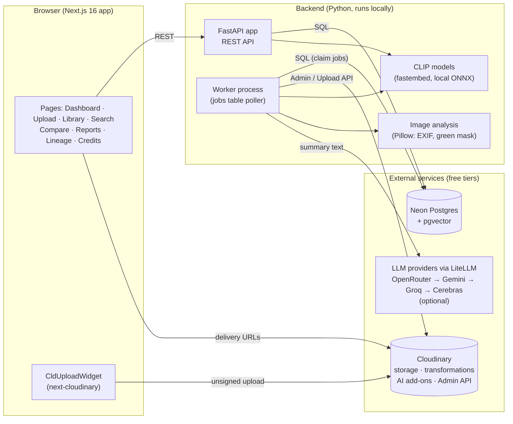

# FieldProof

**Turn a pile of field photos into searchable, traceable proof of impact: AI-tagged evidence, before/after comparisons, and ready-to-share reports, built on Cloudinary.**

Built for Code Cubicle 6.0, problem statement 2 (Cloudinary).

- 🎥 Demo video: `<ADD LINK>`
- 🌐 Live app: `<ADD VERCEL URL>` (frontend on Vercel; the backend runs on our machine behind a fixed ngrok URL).
- 🛟 If the live backend is offline when you visit, the app switches to a **saved snapshot** of the real data and says so in an amber banner: browsing, comparisons, reports and example searches all still work; uploads and creating new items need the live backend. The snapshot is `web/public/snapshot.json`, recorded by `web/scripts/capture_snapshot.py`.

---

## The problem

NGOs and community groups collect photos while planting trees, cleaning public spaces, repairing infrastructure and running other field projects. That evidence stays scattered across phones and drives, so it's hard to show what happened, where it happened and what changed. Building a donor-ready report means hours of manual sorting and hunting for before-and-after images. And teams need confidence that a published image and its numbers can be traced back to the original evidence.

## What it does

FieldProof organizes field photos automatically and turns them into evidence someone can trust:

1. **Upload** photos and videos from a phone or laptop straight to Cloudinary (consent checkbox, optional device location). Videos are analysed from three keyframes (at 10%, 50% and 90% of the clip) and play back in the app.
2. **Automatic analysis**: a background worker reads EXIF date and GPS, embeds each image with CLIP, tags activities (sapling, flood, mangrove, waste, solar…), adds Cloudinary object-detection tags and assigns the photo to the nearest project site.
3. **Search** in plain English ("saplings being planted", "flooded road"), filtered by project, site and tag.
4. **Compare** before and after photos of a site. FieldProof suggests pairs (same site, at least 7 days apart, visually similar), shows a slider and estimates the change in green cover, with the mask shown.
5. **Report**: a project report with numbers, a short summary, before/after evidence and a print/PDF view.
6. **Campaign kit**: social square, story and before/after collage images generated by Cloudinary transformations, all with faces blurred.
7. **Lineage**: every derived image links back to its source asset, transformation string and generating model.

## Goals → features

| Goal (from the problem statement) | Feature in FieldProof | Status |
|---|---|---|
| G1 Analyse and organise large media collections | Direct Cloudinary upload, automatic analysis worker, projects and sites, library view | ✅ |
| G2 Identify projects, activities, locations and visual signals | CLIP zero-shot activity tags, Cloudinary `coco_v2` detection, EXIF date/GPS, auto site assignment | ✅ |
| G3 Before/after comparison | Pair suggestions, comparison slider, estimated green-cover change with mask | ✅ |
| G4 Visual reports, summaries, campaign content | Report page, print/PDF view, campaign kit (square, story, collage) | ✅ |
| G5 AI-powered search and discovery | Semantic search (CLIP text → pgvector) with tag boost and filters | ✅ |
| G6 Traceability to source assets and transformations | Lineage records and a lineage panel on every asset, comparison and kit item | ✅ |

**Roadmap (designed, not built for the hackathon):** map view, video transcription, quote cards, usage-meter page, CI, structured-metadata write-back to Cloudinary, auth, rounding GPS in public views.

## Architecture



- Files go **straight from the browser to Cloudinary**, never through our server.
- **Our database is the source of truth.** Cloudinary is the media store and transformation engine. We never query it in loops (Admin API limit: 500/hour).
- **One Python backend, two processes:** the API (which also embeds search queries) and a worker that runs analysis, comparison and report jobs from a Postgres `jobs` table.

## Tech stack

| Layer | Tech |
|---|---|
| Frontend | Next.js 16, React 19, TypeScript, Tailwind, shadcn/ui (Base UI), next-cloudinary, react-compare-slider |
| Backend | Python 3.12, FastAPI, SQLAlchemy, uv |
| AI | CLIP via fastembed (local ONNX) for tags and search; Cloudinary AI Content Analysis (`coco_v2`); LiteLLM with Gemini 3.5 Flash-Lite (OpenRouter, Groq and Cerebras also supported) for summaries, with a template fallback |
| Media | Cloudinary: upload widget, `g_auto` crops, `e_blur_faces`, collages, Admin API |
| Data | Neon Postgres + pgvector |

## Run it locally

Prerequisites: Node.js ≥ 20.9, pnpm, [uv](https://docs.astral.sh/uv/), a free Cloudinary account and a free Neon Postgres database. Use Linux, macOS or WSL2.

**Backend**

```bash
cd backend
uv sync
cp .env.example .env                        # fill DATABASE_URL and CLOUDINARY_URL; GEMINI_API_KEY (or OPENROUTER_API_KEY) optional
uv run python scripts/migrate.py            # create tables + pgvector
uv run python scripts/setup_cloudinary.py   # create upload presets
uv run uvicorn app.main:app --port 8000     # API → http://localhost:8000/health
uv run python -m app.worker                 # second terminal: job worker
```

The first run downloads the CLIP models (~580 MB). After that, set `HF_HUB_OFFLINE=1` in `.env`.

**Demo data (optional)**

```bash
uv run python scripts/seed_demo.py --drain    # 69 sample photos across 4 sites in India
uv run python scripts/spread_demo_dates.py    # spread their capture dates over Jan–Sep 2026
```

**Frontend**

```bash
cd web
pnpm install
cp .env.example .env.local    # API URL + Cloudinary cloud name and preset
pnpm dev                      # → http://localhost:3000
```

**Tests:** `cd backend && uv run pytest` (40 tests; needs the database configured and no worker running at the same time, since the job tests share the queue).

## How we keep numbers honest

- **Every number comes from our database, never from the language model.** The LLM writes sentences with `{placeholder}` tokens (for example `{assets_total}` or `{delta_green}`), and our code fills in the real values. If the model types a number itself, the gateway rejects that output and falls back to a plain template.
- The app works fully **without any LLM key**. Summaries then use the template, labelled `model: template`.
- Green cover is labelled **"estimated"** everywhere and the mask is viewable, so anyone can see what was counted.

## Privacy

- **Faces are blurred** (`e_blur_faces`) on every image made for sharing: before/after comparisons and all campaign-kit outputs (social square, story, collage).
- Uploaders must **confirm consent** before a photo can be uploaded.
- Location comes from photo EXIF or, only if the user taps "Use my location", from the device.

## Honesty notes

- **Green cover is an estimate** from a simple colour-threshold algorithm, not a scientific survey.
- **The demo data is staged.** The sample photos are from Wikimedia Commons and have no EXIF date or GPS. The seed script places them at 4 sites in India, and `spread_demo_dates.py` assigns them capture dates between January and September 2026 so that before/after pairing and date-ranged reports can be demonstrated. These dates are marked `captured_at_source = manual` in the database. The demo video (`sundarbans_mangrove_walkthrough.mp4`) is a short clip made from two of these Wikimedia photos.

## Credits

Demo photos come from Wikimedia Commons under their respective licences. The full list, with authors and licences, is on the in-app **Credits** page (`/credits`), generated by `backend/scripts/generate_credits.py`.

## Team

| Person | Role |
|---|---|
| Monis | Owner; backend, demo data, merging PRs and submission |
| Ujjwal | Frontend: shared components, library and asset pages |
| Chaubey | Credits page, demo photos and README draft |
| Aditya | Search page, testing, screenshots and demo-video help |
