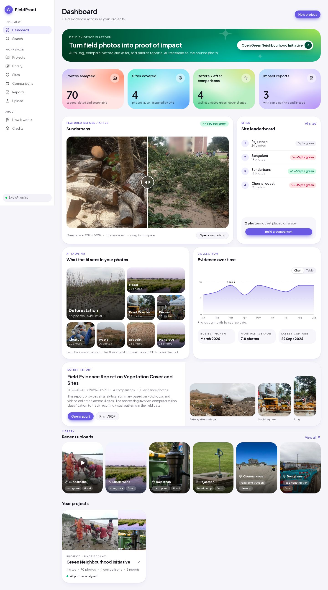
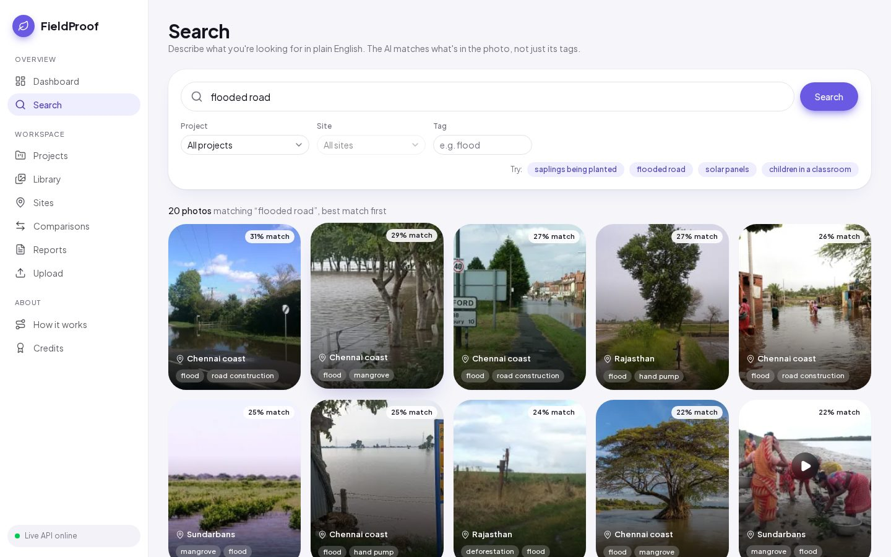
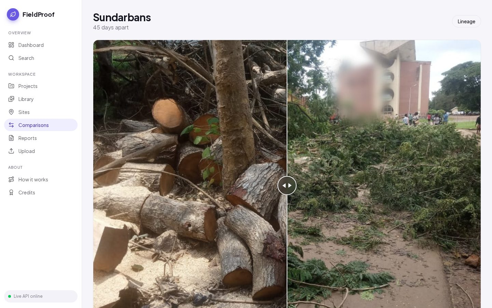
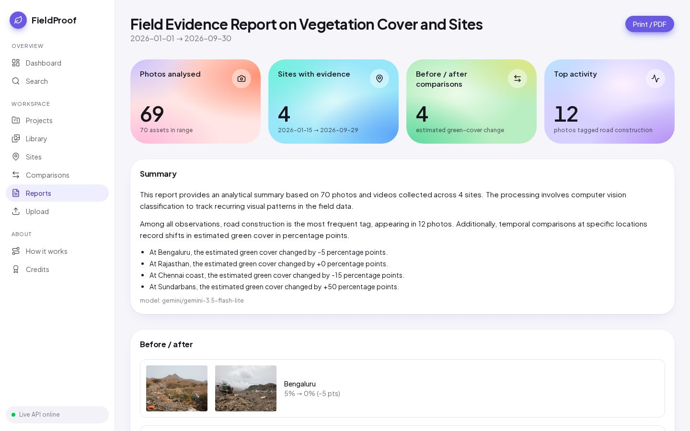
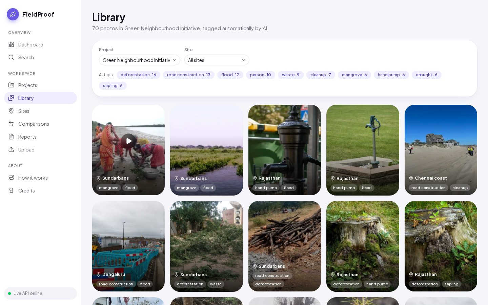
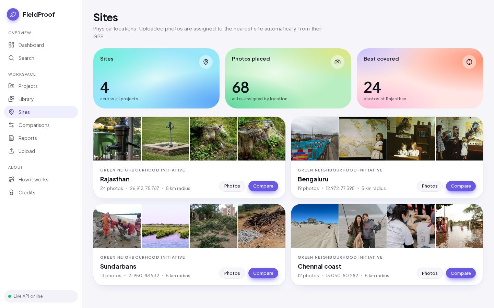
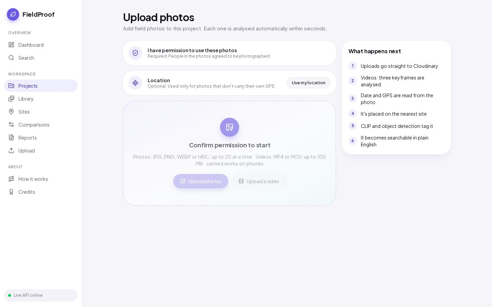
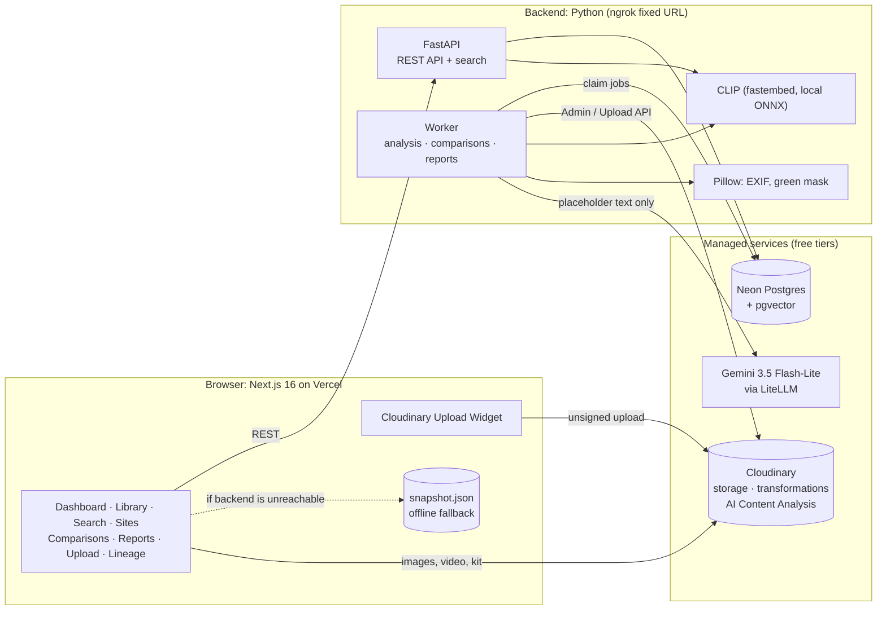
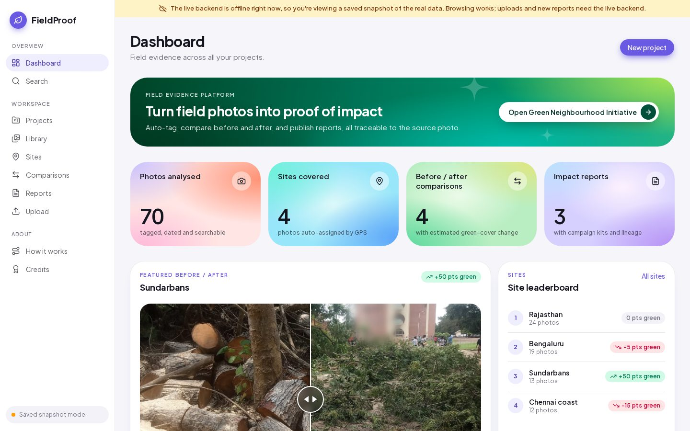

<div align="center">

# 🌿 FieldProof

**Turn field photos and videos into searchable, traceable proof of impact.**

AI-tagged evidence · before/after comparisons · reports and campaign content · full lineage, built on **Cloudinary**.

**[Live app](https://cc-hack-pi.vercel.app)** · **[Demo video](<ADD LINK>)** · [How it works](#how-it-works) · [Run it locally](#run-it-locally)

*Code Cubicle 6.0 · Problem statement 2: AI-Powered Impact & Sustainability Media Platform (Cloudinary)*



</div>

---

## The problem

NGOs, governments and community groups collect thousands of photos and videos while planting mangroves, cleaning beaches, repairing hand pumps and running field programmes. That evidence ends up scattered across phones and drives. Proving what happened, where, and what changed means hours of manual sorting, and when a report is finally published, nobody can trace its images and numbers back to the original evidence.

## What FieldProof does

| | |
|---|---|
| 📤 **Upload from the field** | Photos and videos go from phone or laptop straight to Cloudinary, with a consent check and optional device location. |
| 🧠 **Understands every photo** | A background worker reads the EXIF date and GPS, embeds the image with CLIP, tags what's in it (saplings, mangroves, floods, waste, solar panels…), adds Cloudinary object detection and places it on the nearest project site. Videos are analysed from three keyframes. |
| 🔎 **Search in plain English** | "flooded road", "children in a classroom": the query is embedded with CLIP and matched against every photo, filterable by project, site and tag. |
| ↔️ **Before / after, measured** | FieldProof suggests photo pairs from the same site taken at least 7 days apart, shows them on a drag slider and estimates the change in green cover, with the mask viewable. |
| 📄 **Reports that write themselves** | One click builds a report with metrics, an AI-written summary whose numbers can't be hallucinated, before/after evidence and a print/PDF view. |
| 📣 **Campaign kit** | Cloudinary transformations turn the evidence into a social square, a story and a before/after collage, with faces blurred. |
| 🧾 **Lineage for everything** | Every derived image records its source photo, version, transformation and model, one click away from any asset, comparison or kit item. |

## Screenshots

| Semantic search | Before / after with green-cover estimate |
|---|---|
|  |  |
| **Report with AI summary and campaign kit** | **Library, auto-tagged by AI** |
|  |  |
| **Sites, auto-assigned by GPS** | **Upload photos or video** |
|  |  |

## Problem statement goals → features

| Goal | How FieldProof covers it |
|---|---|
| **Analyse and organise** large collections of image and video evidence | Direct Cloudinary upload, automatic analysis worker, projects → sites → assets, Library with AI-tag filters, video keyframe analysis |
| **Identify** projects, activities, locations and visual signals | CLIP zero-shot tags over a sustainability label set, Cloudinary `coco_v2` object detection, EXIF date and GPS, auto site assignment by distance |
| **Compare before and after** to show visible change | Pair suggestions, drag slider, estimated green-cover change with mask, Comparisons gallery, site leaderboard |
| **Generate** visual reports, summaries and campaign-ready content | Reports with Gemini-written summaries, print/PDF, campaign kit (square, story, collage) |
| **Make media searchable** through AI metadata, tagging and semantic discovery | CLIP text-to-image search on pgvector with a tag boost, filters, AI tag mosaic on the dashboard |
| **Preserve traceability** to source assets and transformations | Lineage records (source public_id, version, transformation, model, time) with a Lineage drawer on assets, comparisons and kit items |

## How it works



1. **Upload.** The browser uploads straight to Cloudinary with an unsigned preset, so files never pass through our server. The app then registers the asset with our API.
2. **Analyse.** A worker process picks the job from a Postgres `jobs` table. It reads the capture date and location, embeds the image (or three video keyframes) with CLIP, tags it, stores the vectors in pgvector and assigns the nearest site.
3. **Search.** The API embeds the text query with the same CLIP model and ranks photos by cosine similarity, boosted by matching tags.
4. **Compare.** For a chosen pair, Cloudinary crops both photos to the same 800×600 frame, then the worker computes a colour-index green mask, uploads the mask to Cloudinary and records the estimated change.
5. **Report.** The worker computes metrics in SQL, picks evidence photos per activity, and asks the LLM for prose built from placeholders only.
6. **Trace.** Every output writes a lineage row: source asset IDs, public IDs and versions, the transformation string and the model used.

**Design choices:** our database is the source of truth, and Cloudinary is the media store and transformation engine. We never call Cloudinary's Admin API in loops (limit: 500 calls an hour). The backend is one Python codebase running two processes, the API and the worker.

## Built on Cloudinary

| Cloudinary feature | Where FieldProof uses it |
|---|---|
| **Upload Widget** (`next-cloudinary`), unsigned presets | Photo and video upload from phone or laptop, themed to the app |
| **AI Content Analysis** (`coco_v2` detection) | Object tags stored alongside the CLIP tags |
| **Image metadata** (`media_metadata`) | EXIF capture date and GPS for timeline and site assignment |
| **`g_auto` smart crop** | Thumbnails, social square and story crops that keep the subject in frame |
| **`e_blur_faces`** | Face blurring on every image made for sharing |
| **Layer / collage transformations** | Side-by-side before/after collage for the campaign kit |
| **Video frame extraction** (`so_`) | Video keyframes for analysis, and poster frames |
| **Derived uploads + Admin API** | Green-cover masks stored as assets; usage checked as a credit guard before building a campaign kit |

## Tech stack

| Layer | Technology |
|---|---|
| Frontend | Next.js 16, React 19, TypeScript, Tailwind CSS 4, shadcn/ui (Base UI), next-cloudinary, react-compare-slider, Plus Jakarta Sans |
| Backend | Python 3.12, FastAPI, SQLAlchemy, uv; a Postgres-backed job queue |
| AI | CLIP ViT-B/32 via fastembed (local ONNX) for tagging and search · Cloudinary AI Content Analysis · Gemini 3.5 Flash-Lite through LiteLLM (OpenRouter, Groq and Cerebras also supported), with a template fallback |
| Data | Neon Postgres + pgvector |
| Hosting | Vercel (web) · backend on our machine behind a fixed ngrok domain · offline snapshot fallback |

## How we keep numbers honest

- **The AI never writes a number.** The model gets placeholder tokens such as `{assets_total}` or `{c1_delta}`, each with a plain description of its meaning, and our code fills in the real values afterwards. The values already include their nouns and units ("70 photos and videos", "+50 percentage points"), so the model can't drop or misstate them.
- **Any AI output containing a literal number is rejected.** The gateway then tries the next model, and finally falls back to a plain template. The model used is shown under every summary (`model: gemini/…` or `model: template`).
- **The prompt forbids spin.** Decreases are reported as decreases, and causes or outcomes the data doesn't show are never invented.
- **Green cover is always an estimate,** labelled as such, and its mask is one click away so anyone can check what was counted.

## Privacy

- **Faces are blurred** (`e_blur_faces`) on everything made for sharing: before/after comparisons and all campaign-kit outputs.
- **Consent is required** before any upload starts.
- **Location** comes from the photo itself. Device location is used only when the uploader taps "Use my location".

## Always available: the snapshot fallback

The backend runs on our own machine. If it's unreachable when you visit, the app switches to a **saved snapshot of the real data** and says so in an amber banner, instead of showing empty pages.

- `web/scripts/capture_snapshot.py` drives a headless browser through every page and records each API response into `web/public/snapshot.json` (220 responses, about 780 KB).
- The frontend's single API helper (`web/lib/api.ts`) serves from the snapshot on a network error, a tunnel error page, or when a request times out and a health check also fails. A backend that is merely slow stays in live mode.
- Photos, video and campaign images keep working because they load straight from Cloudinary. Example searches return their recorded results, and other queries fall back to tag matching. Uploads and new items are disabled with a clear message.



## Run it locally

**Prerequisites:** Node.js ≥ 20.9, pnpm, [uv](https://docs.astral.sh/uv/), a free [Cloudinary](https://cloudinary.com) account and a free [Neon](https://neon.tech) Postgres database. Linux, macOS or WSL2.

### Backend

```bash
cd backend
uv sync
cp .env.example .env                        # DATABASE_URL, CLOUDINARY_URL; GEMINI_API_KEY optional
uv run python scripts/migrate.py            # tables + pgvector
uv run python scripts/setup_cloudinary.py   # upload presets (fp_image, fp_video)
uv run uvicorn app.main:app --port 8000     # API → http://localhost:8000/health
uv run python -m app.worker                 # in a second terminal: the job worker
```

The first run downloads the CLIP models (~580 MB). After that, set `HF_HUB_OFFLINE=1` in `.env`.

To run everything publicly in one command (API, worker and a fixed ngrok tunnel), use `./scripts/run_live.sh`.

### Demo data (optional)

```bash
uv run python scripts/seed_demo.py --drain    # 69 sample photos across 4 sites in India
uv run python scripts/spread_demo_dates.py    # spread capture dates over Jan–Sep 2026
```

### Frontend

```bash
cd web
pnpm install
cp .env.example .env.local    # API URL, Cloudinary cloud name and presets
pnpm dev                      # → http://localhost:3000
```

### Tests

```bash
cd backend && uv run pytest   # 40 tests against the real database
```

Stop the worker first: the job-queue tests share the queue with it.

## Repository layout

```
backend/
  app/core/          config, database, Postgres job queue, LLM gateway (placeholder guard)
  app/fieldproof/    routes, analysis pipelines, search, pairing, green-cover estimate,
                     reports, Cloudinary gateway, transformations, lineage
  app/worker.py      background job runner
  migrations/        SQL schema (pgvector)
  scripts/           setup, seeding, demo dates, credits, run_live.sh
  tests/             pytest suite
web/
  app/               Next.js pages: dashboard, library, search, sites, comparisons,
                     reports (+ print), upload, assets, how-it-works, credits
  components/        UI components and charts
  lib/api.ts         API client with the snapshot fallback
  scripts/           capture_snapshot.py
docs/                design docs, roadmap, screenshots
```

## Honest notes and limitations

- **Green cover is an estimate** from a simple colour-threshold method, not a scientific survey.
- **The demo data is staged.** The sample photos come from Wikimedia Commons and have no EXIF date or GPS. The seed script places them at four sites in India, and `spread_demo_dates.py` gives them capture dates from January to September 2026 so pairing and date-ranged reports can be shown. These dates are marked `captured_at_source = manual`. The demo video is a short clip made from two of these photos.
- **AI tags are suggestions.** CLIP's zero-shot labels are sometimes generous (for example "deforestation" on plantation photos). Anyone can add their own tags to an asset to supplement them.
- **Roadmap:** map view, video transcription, quote cards, a usage dashboard, multi-organisation auth, structured-metadata write-back to Cloudinary, and rounding GPS in public views.

## Credits

The demo photos come from Wikimedia Commons under their respective licences. Every photo, author and licence is listed on the in-app **Credits** page (`/credits`), generated from `backend/samples/public/CREDITS.md` by `backend/scripts/generate_credits.py`.

## Team

| Person | Role |
|---|---|
| **Monis** | Owner: backend, AI pipeline, demo data, deployment and submission |
| **Ujjwal** | Frontend: shared components, library and asset pages |
| **Chaubey** | Credits page, demo photos and README draft |
| **Aditya** | Search page, testing, screenshots and demo-video help |
