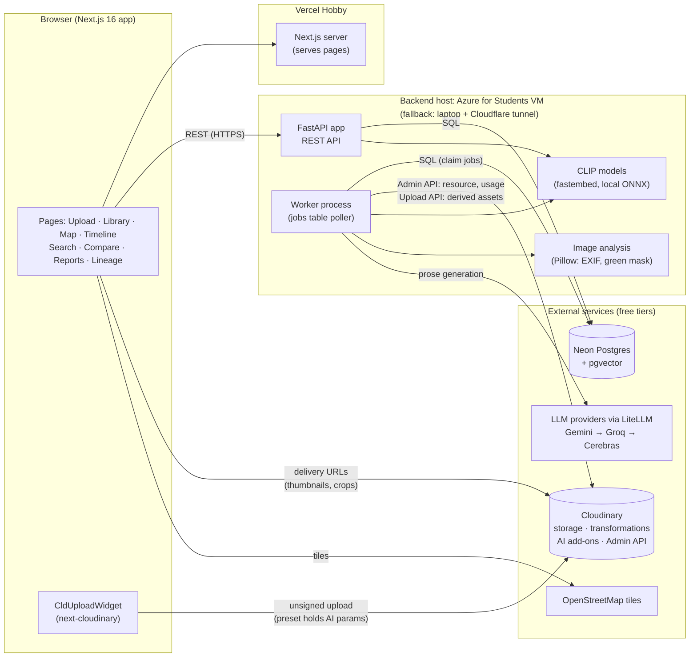
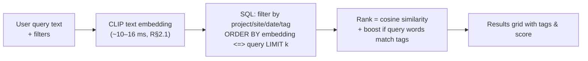
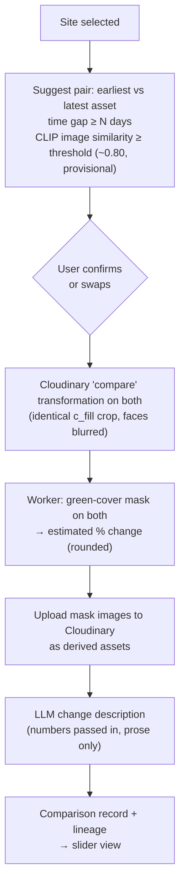
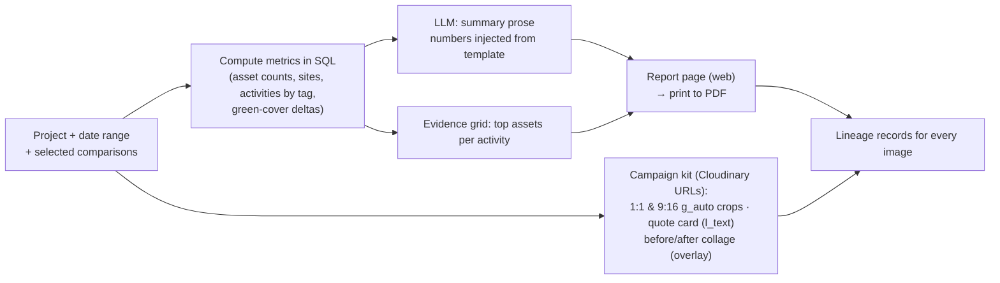

# 01 — High-Level Design: FieldProof

_Product: **FieldProof**, an AI media intelligence platform for NGOs (Code Cubicle 6.0, PS2, Cloudinary)._
_Deadline: **30 Sep 2026** (team decision). Stack: approved in [00-research.md §6](00-research.md)._
_Tags: [VERIFIED: url] · [UNVERIFIED] · [ASSUMPTION]. Facts already sourced in 00-research are referenced as **[R§x.y]**._

---

## 1. Product summary

**One line:** FieldProof turns an NGO's raw field photos and videos into organised, searchable, verifiable evidence, with before/after proof and a ready-to-share impact report.

**Problem.** NGOs collect thousands of field photos and videos. They sit unorganised in phones and drives. Proving impact to donors means hours of sorting, picking before/after shots and building reports by hand, and nobody can trace a published image back to its original.

**What FieldProof does:**
1. **Ingest:** bulk upload photos and videos through the Cloudinary Upload Widget.
2. **Understand:** each asset is auto-tagged (CLIP plus Cloudinary AI), dated, located, and assigned to a project and site.
3. **Organise:** browse evidence by project, site (map) and time (timeline).
4. **Discover:** search in plain English ("waterlogged road near school"), combined with tag, site and date filters.
5. **Prove:** pair before/after shots of the same site, show them in a slider, and give an estimated change metric (green cover %).
6. **Tell the story:** a one-click impact report plus campaign-ready images (social crops, quote card, before/after collage).
7. **Trace:** every output links back to its source asset, the exact Cloudinary transformation URL, and the AI model that produced it.

**Scope for 30 Sep:** a single demo organisation (no auth), about 200 images and 5 short videos, a deployed web app and API. [ASSUMPTION: this size is enough to show every Goal bullet and stays within the free Cloudinary credits, R§1.9]

---

## 2. Users and core journeys

| Persona | Needs | Main screens |
|---|---|---|
| **Field officer** | Upload photos and videos from site quickly; add a project and location if missing | Upload |
| **Programme manager** | See what evidence exists per project, site and time; verify it; find specific shots | Library, Map, Timeline, Search, Asset detail |
| **Communications officer** | Produce before/after proof, reports and social posts for donors | Compare, Reports, Campaign kit |
| **Donor / judge (viewer)** | Read the report and trust it (see where each image came from) | Report view, Lineage panel |

### Core user journeys
- **J1 Upload & analyse:** choose a project, drop files in the widget, and watch each asset move from *processing* to *ready* with tags, date and location.
- **J2 Organise & browse:** open a project, see sites on the map and assets on the timeline, and filter by tag, site or date.
- **J3 Search:** type a natural-language query and get ranked results with tags and similarity. Filters still apply.
- **J4 Before/after:** open a site. The system suggests a before/after pair, which you confirm or swap. The slider shows the estimated green-cover change with the mask overlay and a short AI description.
- **J5 Report & campaign:** pick a project and date range, then generate the report (metrics, AI summary, evidence grid, comparisons). Export it to PDF and generate the campaign kit.
- **J6 Trace:** on any report image or campaign asset, open the Lineage panel: source asset → transformation → output, plus the models used.

---

## 3. Feature list mapped to the Goal bullets

Goal bullets from the problem statement:
- **G1** Analyse and intelligently organise large collections of image and video evidence.
- **G2** Identify relevant projects, activities, locations and visual signals from media.
- **G3** Compare before-and-after media to demonstrate visible project or environmental changes.
- **G4** Generate visual reports, summaries and campaign-ready content from collected evidence.
- **G5** Make media searchable through AI-powered metadata, tagging and semantic discovery.
- **G6** Preserve traceability to the original source assets and transformations.

| # | Feature | G1 | G2 | G3 | G4 | G5 | G6 | How (one line) |
|---|---|:-:|:-:|:-:|:-:|:-:|:-:|---|
| F1 | Bulk upload (images + video) | ● | | | | | ● | CldUploadWidget with an unsigned preset; the backend registers each asset [R§1.4, R§1.8] |
| F2 | Automatic analysis pipeline | ● | ● | | | ● | | Background job: metadata → CLIP embedding → tags → location → site [R§2.1] |
| F3 | AI tagging (activities / visual signals) | | ● | | | ● | | CLIP zero-shot top-3 over a sustainability label set, plus Cloudinary `coco_v2` detection tags [R§1.4, R§2.1] |
| F4 | Date & location extraction | ● | ● | | | | | EXIF via `media_metadata` → device geolocation → manual pin [R§1.4] |
| F5 | Projects & sites (auto-assign by GPS) | ● | ● | | | | | Nearest site within a radius, otherwise "unassigned" for manual placement [ASSUMPTION] |
| F6 | Library, Map & Timeline views | ● | ● | | | | | Grid of thumbnails, Leaflet map of sites, timeline by capture date [R§3] |
| F7 | Video evidence | ● | ● | | | ● | | Keyframes via `so_` offsets are embedded and tagged like images [R§1.6] |
| F8 | Semantic + filtered search | | | | | ● | | CLIP text embedding → pgvector cosine, filtered in SQL by project, site, date and tag [R§4] |
| F9 | Before/after pairing & slider | | | ● | | | ● | Pair suggestion (same site, time gap, similarity ≥ threshold), aligned crops, react-compare-slider [R§2.1, R§3] |
| F10 | Change metric (estimated green cover) | | ● | ● | ● | | | Pillow colour-index mask on aligned images, rounded, labelled "estimated", mask shown [ASSUMPTION] |
| F11 | AI change description | | | ● | ● | | | LLM prose from metrics and tags (face-blurred image only for the vision model) [R§2.2] |
| F12 | Impact report (web + PDF) | | | ● | ● | | ● | Templated numbers + LLM summary + evidence grid, printed to PDF [R§3] |
| F13 | Campaign kit | | | | ● | | ● | Cloudinary transformations: `g_auto` social crops, text-overlay card, before/after collage [R§1.6] |
| F14 | Lineage panel & records | | | | | | ● | Every output stores source public_id/version, transformation string, URL, model and timestamp |
| F15 | Privacy guard | | | | ● | | | `e_blur_faces` on all displayed and shared derivatives; GPS rounded in public views [R§1.6] |
| F16 | Credit & quota meter | | | | | | | Cloudinary `GET /usage` shown in the admin view [R§1.7] (operational safety, not a Goal) |

**Coverage check:** G1 → F1, F2, F4, F5, F6, F7 · G2 → F2–F7, F10 · G3 → F9–F12 · G4 → F10–F13, F15 · G5 → F2, F3, F7, F8 · G6 → F1, F9, F12–F14. Every Goal bullet has at least 3 features.

---

## 4. System architecture



**Key architectural choices:**
- **Browser → Cloudinary direct upload.** Files never pass through our server, so there's no size or bandwidth pressure on the backend [R§1.4].
- **Our database is the source of truth.** Cloudinary is the media store and transformation engine. We don't query it in loops, because of the 500/hour Admin API limit [R§1.1, R§1.7].
- **One Python backend with two processes:** the API, and a worker that polls the jobs table. CLIP runs in both: the API for search queries, the worker for images [ASSUMPTION: two copies of the ~0.6 GB models must fit in the VM's RAM. To measure, see 00-research §8 item 8].
- **No auth.** A single demo organisation [R§6.2 approved].

---

## 5. Major components and responsibilities

| Component | Responsibility | Tech |
|---|---|---|
| **Web app** | All UI; the upload widget; renders Cloudinary delivery URLs; report print view | Next.js 16, next-cloudinary, shadcn/ui, react-leaflet, react-compare-slider [R§3] |
| **API service** | REST endpoints for projects, sites, assets, search, comparisons, reports, lineage and usage; validates input; enqueues jobs | FastAPI (plain `def` for CPU work) [R§3] |
| **Worker** | Runs jobs: analyse asset, build comparison, generate report text, build campaign kit; retries and backoff | Python process, Postgres `SKIP LOCKED` job table [R§5.3] |
| **Embedding service** (module) | Loads CLIP once; embeds images, keyframes and text queries; zero-shot tagging | fastembed CLIP ViT-B/32, 512-d [R§2.1] |
| **Media analysis** (module) | EXIF/date/GPS parsing, orientation fix, green-cover mask, framing check | Pillow, pillow-heif, numpy |
| **Cloudinary gateway** (module) | Every Cloudinary call: build transformation URLs with the SDK, Admin API `resource`/`usage`, uploads of derived assets (masks, report images) | `cloudinary` Python SDK [R§1] |
| **LLM gateway** (module, shared with PS1) | Grounded prose generation, JSON schema output, provider fallback, response cache | LiteLLM Router [R§2.2] |
| **Data store** | Projects, sites, assets, embeddings, tags, jobs, comparisons, reports, lineage | Neon Postgres + pgvector, SQLAlchemy [R§4] |
| **Media store** | Originals and derivatives; AI detection | Cloudinary Free [R§1] |

**Shared with PS1 (Scout):** the LLM gateway, the job runner, the DB session/config, and the web app shell (layout, data table, job progress). These live in `core/` and `web/components/`. PS2 doesn't depend on anything PS1-specific. [ASSUMPTION: this keeps PS2 simple while letting PS1 reuse the plumbing]

---

## 6. Data flow for the main journeys

### 6.1 Upload → analysis (J1)
```mermaid
sequenceDiagram
    actor U as Field officer
    participant W as Web (CldUploadWidget)
    participant C as Cloudinary
    participant A as FastAPI
    participant D as Postgres
    participant K as Worker

    U->>W: choose project, drop files
    W->>C: unsigned upload (preset: media_metadata, detection coco_v2, auto_tagging, incoming resize)
    C-->>W: upload result (public_id, asset_id, version, tags, image_metadata)
    W->>A: POST register asset (public_id, project, device location?, consent)
    A->>D: upsert asset (status=pending) + enqueue analyse job
    A-->>W: 202 accepted
    K->>D: claim job (SKIP LOCKED)
    K->>C: Admin API resource(public_id) — authoritative metadata + detection
    K->>C: fetch analysis derivative (w_1024, f_jpg)
    K->>K: EXIF → date/GPS · CLIP embed · zero-shot tags · site assignment
    K->>D: save metadata, tags, embedding, lineage; status=ready
    W->>A: poll asset status
    A-->>W: ready + tags + location
```

### 6.2 Search (J3)

- [ASSUMPTION] Exact scan without an index is fast enough at the demo scale (~200–1,000 vectors). HNSW can be added later [R§4].

### 6.3 Before/after (J4)

- The 0.80 threshold comes from one same-scene pair in our benchmark, so it's provisional [R§2.1].
- The green-cover metric is an **estimate**. It is affected by lighting and framing [ASSUMPTION]. Mitigations: identical crops, a region of interest, the mask shown to the user, rounding to 5%.

### 6.4 Report & campaign (J5)


### 6.5 Traceability (J6)
Every derived item (thumbnail, crop, mask, collage, report image, AI text) gets a **lineage record** containing:
- the source asset(s) (Cloudinary `public_id`, `version`, `asset_id`);
- the transformation string and the full delivery URL;
- the model name and version (CLIP, LLM) or algorithm version (green mask);
- a timestamp.

The Lineage panel shows these records as a chain. Cloudinary URLs encode the transformation, so a judge can open the URL and reproduce the output [VERIFIED behaviour of delivery URLs: https://cloudinary.com/documentation/transformation_reference].

---

## 7. External services and integration points

| Service | Integration | Direction | Limits that matter |
|---|---|---|---|
| **Cloudinary Upload API** | CldUploadWidget → unsigned preset | Browser → Cloudinary | 10 MB image / 100 MB video; AI parameters only through the preset [R§1.1, R§1.4] |
| **Cloudinary delivery** | Transformation URLs (thumb, analysis, compare, square, story, card, collage) | Browser/worker → Cloudinary | Credits: 25 over a rolling 30 days; account disabled if exceeded [R§1.1] |
| **Cloudinary Admin API** | `resource` (once per asset), `usage` (meter) | Worker → Cloudinary | 500 requests/hour [R§1.1] |
| **Cloudinary AI add-ons** | `detection: coco_v2` + `auto_tagging` in the preset; optional AI Vision tagging | Via upload | Free quotas UNVERIFIED; hard stop when exhausted [R§1.3] |
| **Neon Postgres** | SQLAlchemy over the direct connection string | API/worker → DB | 0.5 GB; scales to zero after 5 min [R§4] |
| **LLM providers** | LiteLLM Router: Gemini 3.5 Flash-Lite → Groq gpt-oss-20b → Cerebras gpt-oss-120b; Groq qwen3.8-27b for vision | Worker → providers | Gemini limits unpublished; Groq 30 RPM / 1K RPD [R§2.2] |
| **OpenStreetMap tiles** | react-leaflet TileLayer with attribution | Browser → OSM | No bulk download; attribution required [R§3] |
| **Vercel** | Hosts the Next.js app | — | Non-commercial Hobby [R§5.2] |
| **Azure for Students** | VM hosting FastAPI + worker | — | $100 credit; VM size/RAM to confirm [UNVERIFIED] |

---

## 8. Non-functional requirements

| Area | Requirement | Basis |
|---|---|---|
| **Performance: analysis** | An image is searchable within ~10 s of upload (network + one Admin API call + ~50 ms CLIP) | [ASSUMPTION: from R§2.1 benchmark; network time not measured] |
| **Performance: search** | Query → results in < 1 s at demo scale | [ASSUMPTION: 10–16 ms embed (R§2.1) + exact scan of ≤1k vectors] |
| **Performance: UI** | Library grid uses ~300 px `f_auto,q_auto` thumbnails and lazy loading | [ASSUMPTION] |
| **Reliability** | Jobs survive restarts (DB-backed queue); failed jobs retry with backoff; a "reprocess" action exists | [R§5.3] |
| **Reliability: demo** | The demo dataset is fully pre-processed; demo mode reads cached results only; a backup video is recorded | [ASSUMPTION] |
| **Security: secrets** | API secret and LLM keys live only on the backend. The frontend gets only the cloud name and preset name. | [R§1.8]; Next.js exposes `NEXT_PUBLIC_*` to the browser [VERIFIED: https://nextjs.org/docs/app/guides/environment-variables] |
| **Security: upload abuse** | The unsigned preset restricts formats and size, with a fixed folder | [R§1.4] |
| **Security: CORS** | Exact origin allow-list | [R§3] |
| **Privacy** | Faces blurred on displayed and shared derivatives; public GPS rounded to ~100 m; no identifiable images sent to the Gemini free tier; per-upload consent flag | [R§1.6, R§2.2] |
| **Scalability (demo)** | ~200 images, 5 videos, ≤ 1k vectors; single VM; exact vector scan | [ASSUMPTION] |
| **Scalability (story for judges)** | Direct-to-Cloudinary upload, a stateless API, a queue-based worker, and an HNSW index are the path to large collections | [R§4] |
| **Cost** | ₹0: all free tiers; Cloudinary target under 10 of 25 credits; Azure student credit | [R§6] |
| **Offline resilience** | CLIP runs locally with `HF_HUB_OFFLINE=1`, and LLM text is cached in the DB | [R§2.1] |

---

## 9. Key trade-offs

| Decision | Chosen | Gave up | Why |
|---|---|---|---|
| Semantic search engine | Own CLIP + pgvector | Cloudinary DAM visual search | Enterprise-only [R§1.7]; our own version also demonstrates AI work |
| Tagging | CLIP top-3 + Cloudinary `coco_v2` | Cloudinary add-ons only | Add-on quotas unknown and hard-stopping [R§1.3]; CLIP is unlimited but ~79% top-1 [R§2.1] |
| Tag presentation | "Suggested" top-3 | Threshold-based auto tags | CLIP score ranges overlap, so no clean threshold [R§2.1] |
| Upload path | Unsigned direct upload | Signed upload via backend | Simpler, no file bytes through the API; abuse risk mitigated by preset restrictions [R§1.4] |
| Job runner | Postgres table + `SKIP LOCKED` | Redis queue / Procrastinate / BackgroundTasks | No extra infra; survives restarts [R§5.3] |
| Change metric | Green-cover % estimate | True change detection (alignment, segmentation) | Feasible in the timeline; honest labelling and mask overlay [ASSUMPTION] |
| Report text | LLM prose with templated numbers | Fully LLM-written report | Prevents invented statistics [R§2.2] |
| PDF | Browser print CSS | @react-pdf/renderer | One rendering path [R§3] |
| Auth | None (single demo org) | Better Auth / Clerk | No Goal bullet needs it; saves days [R§6.2] |
| Backend host | Azure for Students VM | HF Spaces PRO ($9), Oracle (card) | Free and enough RAM [R§5.1]; laptop + tunnel as fallback |
| Video depth | Keyframe tagging and search | Transcription / auto-chapters | Credit cost and unverified add-on quotas [R§1.2, R§1.3] |

---

## 10. Open items this HLD depends on
_All of these are also listed in 06-risks later._
1. Free quotas for the Cloudinary AI add-ons (`coco_v2` detection, AI Vision) [UNVERIFIED].
2. Whether `g_auto` and `e_blur_faces` work on the Free plan (one test URL each) [UNVERIFIED].
3. The Azure for Students VM size and RAM, and real RAM usage of API + worker with CLIP loaded twice [UNVERIFIED].
4. HTTPS for the Azure backend so the Vercel (HTTPS) site can call it. The plan is a TLS reverse proxy on the VM [UNVERIFIED; LLD/deployment docs will specify].
5. The before/after similarity threshold, validated on our own photos [ASSUMPTION].
6. Gemini free-tier image input (only matters if we move vision off Groq) [UNVERIFIED].
