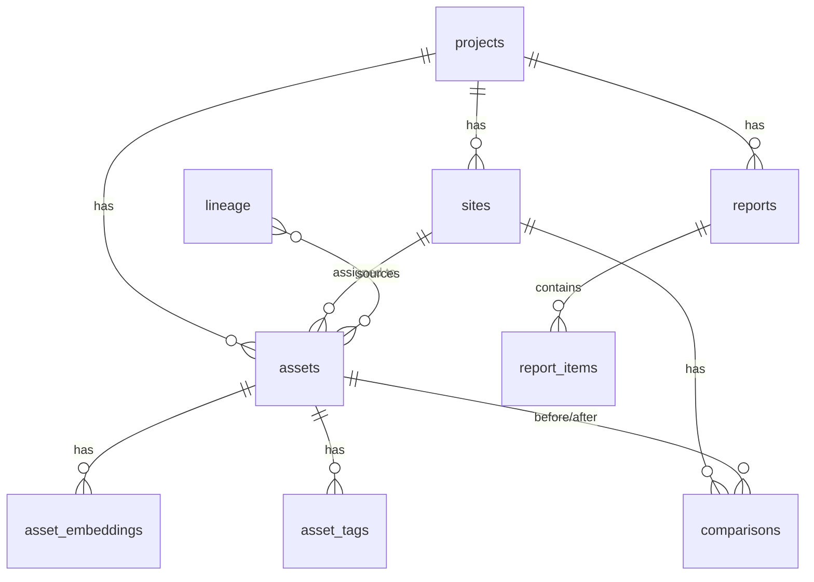
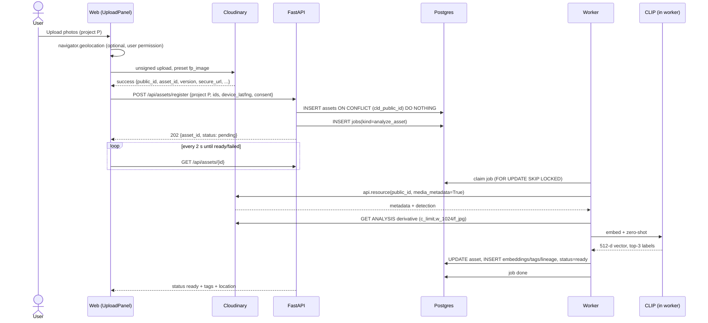
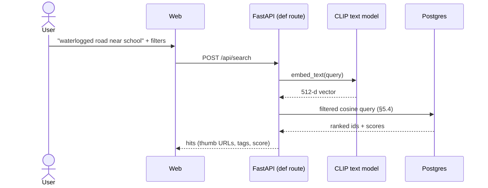
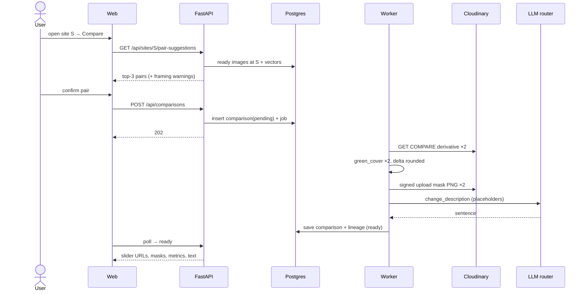
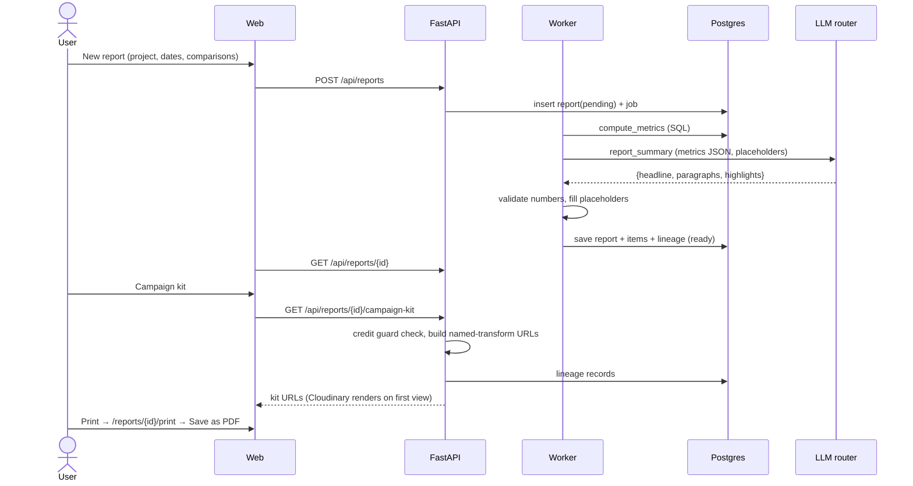

# 02 — Low-Level Design: FieldProof

_Builds on [01-hld.md](01-hld.md). Tags: [VERIFIED: url/source] · [UNVERIFIED] · [ASSUMPTION]. **[R§x]** = fact sourced in [00-research.md](00-research.md)._

_Python SDK facts in this doc come from `cloudinary` **1.46.2**, installed in a throwaway environment on 24 Sep 2026. It exposes `api.resource`, `api.resource_by_asset_id`, `api.usage`, `api.add_metadata_field`, `uploader.upload`, `uploader.update_metadata`, `uploader.explicit`, `uploader.destroy`, `utils.cloudinary_url` and `CloudinaryImage(...).build_url`. `build_url` produced `…/c_fill,g_auto,h_600,w_800/e_blur_faces/v1/sites/a` and a video frame URL `…/video/upload/so_2/vid.jpg`. These are referred to below as **[SDK-1.46.2]**._

> **New design choices in this doc** are marked 🟡 and listed in §12. **Status: all approved by the team on 24 Sep 2026.**

---

## 1. Module map

### 1.1 Backend (`backend/app/`)
| Module | Responsibility | Public interface (Python signatures) |
|---|---|---|
| `core/config.py` | Typed settings from env | `settings: Settings` (already exists) |
| `core/db.py` | Engine and session, health check | `get_engine()`, `get_session() -> Session`, `check_database()` (engine and check already exist) |
| `core/jobs.py` | DB job queue (shared with PS1) | `enqueue(kind: str, payload: dict, run_after: datetime \| None = None) -> int`; `claim(kinds: list[str]) -> Job \| None`; `complete(job_id)`; `fail(job_id, error: str)` |
| `core/llm.py` | LiteLLM router + cache + grounded generation (shared with PS1) | `generate_json(task: str, prompt: str, schema: type[BaseModel], inputs: dict) -> BaseModel` |
| `core/errors.py` | API error envelope | `ApiError(code: str, message: str, status: int, details: dict \| None = None)` |
| `fieldproof/models.py` | SQLAlchemy ORM models (§2) | ORM classes |
| `fieldproof/schemas.py` | Pydantic request/response models (§3) | Pydantic classes |
| `fieldproof/cloudinary_gw.py` | Every Cloudinary call | `get_resource(public_id, resource_type) -> dict`; `url(public_id, preset: NamedTransform, resource_type='image', **kw) -> str`; `upload_derived(data: bytes, folder: str) -> dict`; `usage() -> dict` |
| `fieldproof/transforms.py` | The **fixed** set of named transformations (credit control) | `NamedTransform` enum + `TRANSFORMS: dict[NamedTransform, list[dict]]` |
| `fieldproof/embeddings.py` | Load CLIP once; embed images and text | `embed_images(imgs: list[Image]) -> np.ndarray`; `embed_text(q: str) -> np.ndarray`; `zero_shot(vec) -> list[TagScore]` |
| `fieldproof/metadata.py` | EXIF/GPS/date parsing and validation | `parse_media_metadata(meta: dict) -> ParsedMeta`; `dms_to_decimal(s: str) -> float`; `resolve_location(...)`; `resolve_captured_at(...)` |
| `fieldproof/sites.py` | Site assignment | `assign_site(project_id, lat, lng) -> UUID \| None` |
| `fieldproof/change.py` | Green-cover mask and framing check | `green_cover(img: Image) -> GreenResult`; `framing_ok(sim: float) -> bool` |
| `fieldproof/search.py` | Semantic + filtered search | `search(q: SearchRequest) -> list[SearchHit]` |
| `fieldproof/reports.py` | Metrics, text, campaign kit | `compute_metrics(...)`; `build_campaign_kit(report_id) -> list[KitItem]` |
| `fieldproof/lineage.py` | Write and read lineage | `record(output_kind, output_ref, sources, tool, model=None, transformation=None, params=None, entity=None)`; `for_entity(type, id)` |
| `fieldproof/pipelines.py` | Job handlers | `analyze_asset(payload)`, `build_comparison(payload)`, `generate_report(payload)` |
| `fieldproof/routes.py` | FastAPI routers (§3) | `router: APIRouter` |
| `worker.py` | Worker entry point (poll loop) | `python -m app.worker` |
| `main.py` | FastAPI app, CORS, routers, `/health` | exists; routers get mounted here |

**Rule:** every CPU-heavy route (search, anything that uses CLIP or Pillow) is a plain `def`, never `async def` [VERIFIED: https://fastapi.tiangolo.com/async/].

### 1.2 Frontend (`web/`)
| Area | Contents |
|---|---|
| `app/` (routes) | `/` dashboard · `/projects/[id]` overview · `/projects/[id]/upload` · `/projects/[id]/library` · `/projects/[id]/map` · `/projects/[id]/timeline` · `/search` · `/assets/[id]` · `/sites/[id]/compare` · `/comparisons/[id]` · `/reports/[id]` · `/reports/[id]/print` · `/admin/usage` |
| `components/` | AppShell (sidebar) · AssetCard · AssetGrid · TagChips · StatusBadge · UploadPanel (CldUploadWidget) · SiteMap (client-only Leaflet) · Timeline · SearchBar/Filters · CompareSlider (react-compare-slider) · GreenMaskToggle · LineagePanel · ReportView · CampaignKit · UsageMeter |
| `lib/api.ts` | Typed fetch wrapper for the FastAPI base URL, plus a `usePoll` hook for status polling |
| `lib/cld.ts` | Helpers around next-cloudinary `getCldImageUrl` for display URLs [R§1.8] |

**Rule:** Leaflet and the slider are loaded with `next/dynamic({ ssr: false })` **inside a Client Component** [VERIFIED: https://nextjs.org/docs/app/guides/lazy-loading].

---

## 2. Database schema (Neon Postgres + pgvector)

- Every primary key is a `uuid` (generated in Python) unless noted. Timestamps are `timestamptz`, defaulting to `now()`. Enums are Postgres `text` columns with a `CHECK` constraint.
- 🟡 [ASSUMPTION: text + CHECK is easier to change than native ENUM types during a hackathon]



### 2.1 Tables

**projects**
| Column | Type | Notes |
|---|---|---|
| id | uuid PK | |
| name | text NOT NULL | |
| description | text | |
| started_on | date | Used to validate capture dates |
| created_at | timestamptz | |

**sites**
| Column | Type | Notes |
|---|---|---|
| id | uuid PK | |
| project_id | uuid FK → projects ON DELETE CASCADE | index |
| name | text NOT NULL | |
| lat, lng | double precision NOT NULL | Site centre |
| radius_m | integer NOT NULL DEFAULT 200 | 🟡 [ASSUMPTION: 200 m auto-assign radius] |
| created_at | timestamptz | |

**assets**
| Column | Type | Notes |
|---|---|---|
| id | uuid PK | |
| project_id | uuid FK → projects | index |
| site_id | uuid FK → sites, NULL | index; NULL = unassigned |
| cld_public_id | text NOT NULL **UNIQUE** | Makes double registration impossible |
| cld_asset_id | text NOT NULL UNIQUE | Immutable Cloudinary ID |
| cld_version | integer NOT NULL | Needed to rebuild exact URLs (lineage) |
| resource_type | text CHECK IN ('image','video') | |
| format | text | e.g. jpg, heic, mp4 |
| width, height | integer | |
| bytes | bigint | |
| duration_s | real NULL | Video only |
| secure_url | text NOT NULL | Original delivery URL, from the upload result |
| captured_at | timestamptz NULL | index |
| captured_at_source | text CHECK IN ('exif','upload','manual') | |
| lat, lng | double precision NULL | Full precision, **never returned by public endpoints** |
| location_source | text CHECK IN ('exif','device','manual','none') | |
| consent_confirmed | boolean NOT NULL DEFAULT false | Set from the upload form |
| status | text CHECK IN ('pending','processing','ready','failed') | index |
| error | text NULL | Last failure message |
| media_metadata | jsonb | Raw `image_metadata` node from Cloudinary [R§1.4] |
| cld_detection | jsonb | Raw detection output (`info.detection…`) [R§1.4] |
| created_at, updated_at | timestamptz | |

**asset_embeddings**
| Column | Type | Notes |
|---|---|---|
| asset_id | uuid FK → assets ON DELETE CASCADE | PK part |
| frame_s | real NOT NULL DEFAULT 0 | PK part; 0 for images, the keyframe offset for video |
| embedding | vector(512) NOT NULL | L2-normalised by fastembed [R§2.1] |
| model | text NOT NULL | `Qdrant/clip-ViT-B-32-vision` |

- No vector index for the MVP: exact scan. 🟡 [ASSUMPTION: ≤ ~1k vectors]. Upgrade path: `CREATE INDEX … USING hnsw (embedding vector_cosine_ops)` [VERIFIED: https://github.com/pgvector/pgvector].

**asset_tags**
| Column | Type | Notes |
|---|---|---|
| asset_id | uuid FK → assets ON DELETE CASCADE | PK part |
| tag | text NOT NULL | PK part; normalised lowercase |
| source | text CHECK IN ('clip','cld_detection','manual') | PK part |
| score | real NULL | CLIP cosine or detection confidence |
| rank | smallint NULL | 1–3 for CLIP top-3 |

Index: `(tag)`.

**comparisons**
| Column | Type | Notes |
|---|---|---|
| id | uuid PK | |
| site_id | uuid FK → sites | index |
| before_asset_id, after_asset_id | uuid FK → assets | CHECK before ≠ after |
| image_similarity | real | CLIP cosine between the two analysis images |
| framing_warning | boolean | similarity < threshold |
| before_green_pct, after_green_pct | real | Raw values |
| delta_green_pct_rounded | smallint | Rounded to nearest 5 |
| before_mask_public_id, after_mask_public_id | text NULL | Mask overlays uploaded to Cloudinary |
| description | text NULL | LLM prose |
| description_model | text NULL | |
| status | text CHECK IN ('pending','processing','ready','failed') | |
| created_at | timestamptz | |

**reports**
| Column | Type | Notes |
|---|---|---|
| id | uuid PK | |
| project_id | uuid FK → projects | |
| date_from, date_to | date | |
| metrics | jsonb | Output of `compute_metrics` (§5.5) |
| summary | jsonb | `{headline, paragraphs[], highlights[]}` after placeholder fill |
| summary_model | text | |
| status | text CHECK IN ('pending','processing','ready','failed') | |
| created_at | timestamptz | |

**report_items**
| Column | Type | Notes |
|---|---|---|
| report_id | uuid FK → reports ON DELETE CASCADE | PK part |
| position | smallint | PK part |
| kind | text CHECK IN ('asset','comparison') | |
| asset_id | uuid NULL | |
| comparison_id | uuid NULL | |
| section | text | e.g. 'activities', 'before_after' |

**lineage**
| Column | Type | Notes |
|---|---|---|
| id | uuid PK | |
| entity_type | text | 'asset' / 'comparison' / 'report' / 'kit' — index (entity_type, entity_id) |
| entity_id | uuid | |
| output_kind | text | 'thumbnail','analysis','compare','mask','social_square','social_story','quote_card','collage','embedding','tags','ai_text' |
| output_ref | text | Delivery URL, or `db:<table>:<id>` for non-media outputs |
| source_asset_ids | uuid[] | |
| source_public_ids | text[] | |
| source_versions | integer[] | |
| tool | text | 'cloudinary','clip','pillow','llm' |
| transformation | text NULL | Exact transformation string (Cloudinary) |
| model | text NULL | CLIP / LLM model ID actually used |
| params | jsonb | Thresholds, prompt hash, algorithm version |
| created_at | timestamptz | |

**jobs** (in `core/`, shared with PS1)
| Column | Type | Notes |
|---|---|---|
| id | bigserial PK | |
| kind | text NOT NULL | 'analyze_asset','build_comparison','generate_report' |
| payload | jsonb NOT NULL | |
| status | text CHECK IN ('queued','running','done','failed') | |
| attempts | smallint DEFAULT 0 | |
| max_attempts | smallint DEFAULT 5 | |
| run_after | timestamptz DEFAULT now() | Used for backoff |
| locked_at | timestamptz NULL | |
| last_error | text NULL | |
| created_at, updated_at | timestamptz | |

Index: `(status, run_after)`.

**llm_cache** (in `core/`)
| Column | Type | Notes |
|---|---|---|
| key | text PK | sha256(task + model chain + prompt + inputs) |
| model | text | Model that answered |
| response | jsonb | |
| created_at | timestamptz | |

### 2.2 Migrations
- 🟡 Plain numbered SQL files (`backend/migrations/0001_init.sql` …) applied by a small script over the **direct** Neon URL. [R§4: migrations must use the direct connection]. Alternative: Alembic (see §12).
- `0001` starts with `CREATE EXTENSION IF NOT EXISTS vector;` [VERIFIED: https://neon.com/docs/extensions/pgvector].

### 2.3 Storage estimate
[ASSUMPTION] Per image: 1 embedding (512 × 4 bytes ≈ 2 KB) + a metadata row (≈ 2–10 KB jsonb) → **1,000 assets ≈ 15 MB**, far below Neon's 0.5 GB [R§4].

---

## 3. REST API (FastAPI, base path `/api`)

**Error envelope:** `{"error": {"code": "STRING_CODE", "message": "human text", "details": {...}}}`.

**Common codes:**
| HTTP | Code | Meaning |
|---|---|---|
| 400 | `BAD_REQUEST` | Malformed input |
| 404 | `NOT_FOUND` | Unknown ID |
| 409 | `CONFLICT` | e.g. asset already registered |
| 422 | `VALIDATION_ERROR` | Schema validation failed |
| 429 | `RATE_LIMITED` | Upstream rate limit reached |
| 502 | `UPSTREAM_ERROR` | Cloudinary or LLM failed |
| 503 | `CREDIT_GUARD` | Cloudinary credit usage above the guard threshold (§6.3) |
| 503 | `DB_UNAVAILABLE` | Database unreachable |

### 3.1 Endpoints
| Method & path | Request | Response | Errors |
|---|---|---|---|
| `GET /health` | — | `{status, database{status,pgvector}, cloudinary_configured, clip_models_downloaded}` | — (exists) |
| `GET /api/projects` | — | `Project[]` with counts | — |
| `POST /api/projects` | `{name, description?, started_on?}` | `Project` | 422 |
| `GET /api/projects/{id}` | — | `Project` + `{asset_count, site_count, ready_count, failed_count}` | 404 |
| `GET /api/projects/{id}/sites` | — | `Site[]` with `asset_count` | 404 |
| `POST /api/projects/{id}/sites` | `{name, lat, lng, radius_m?}` | `Site` | 404, 422 |
| `PATCH /api/sites/{id}` | `{name?, lat?, lng?, radius_m?}` | `Site` | 404, 422 |
| `POST /api/assets/register` | `{project_id, public_id, asset_id, version, resource_type, secure_url, format, width, height, bytes, duration?, device_lat?, device_lng?, consent_confirmed}`, taken from the widget success result | `202 {asset_id, status:'pending'}` | 404 project, 409 duplicate public_id (returns the existing ID), 422 |
| `GET /api/assets` | query: `project_id, site_id?, tag?, from?, to?, status?, resource_type?, cursor?, limit≤60` | `{items: AssetCard[], next_cursor}` | 422 |
| `GET /api/assets/{id}` | — | `AssetDetail` (tags by source, rounded lat/lng, captured_at + source, status, display URLs) | 404 |
| `PATCH /api/assets/{id}` | `{site_id?, captured_at?, lat?, lng?, add_tags?[], remove_tags?[]}`; manual edits set `*_source='manual'` | `AssetDetail` | 404, 422 |
| `POST /api/assets/{id}/reprocess` | — | `202 {job_id}` | 404 |
| `GET /api/projects/{id}/timeline` | query: `bucket=day\|week\|month` | `[{bucket_start, count, sample_asset_ids[]}]` | 404 |
| `GET /api/projects/{id}/map` | — | `{sites:[{id,name,lat,lng,asset_count}], unassigned:[{asset_id, lat_r, lng_r}]}` (coordinates rounded to 3 dp) | 404 |
| `POST /api/search` | `{query, project_id?, site_id?, tags?[], from?, to?, resource_type?, limit≤50}` | `[{asset: AssetCard, score, matched_frame_s?}]` | 422 |
| `GET /api/sites/{id}/pair-suggestions` | — | `[{before: AssetCard, after: AssetCard, image_similarity, framing_warning, days_apart}]` (top 3) | 404 |
| `POST /api/comparisons` | `{site_id, before_asset_id, after_asset_id}` | `202 {comparison_id, job_id}` | 404, 422 (same asset, not images, not ready) |
| `GET /api/comparisons/{id}` | — | `Comparison` (+ compare URLs, mask URLs, metrics, description, lineage count) | 404 |
| `POST /api/reports` | `{project_id, date_from, date_to, comparison_ids[]}` | `202 {report_id, job_id}` | 404, 422 |
| `GET /api/reports/{id}` | — | `Report` (metrics, filled summary, items with URLs) | 404 |
| `GET /api/reports/{id}/campaign-kit` | — | `[{kind, url, source_asset_id, transformation}]`, built from named transforms and recorded in lineage | 404, 503 CREDIT_GUARD |
| `GET /api/lineage` | query: `entity_type, entity_id` | `LineageRecord[]` | 422 |
| `GET /api/usage` | — | Cloudinary usage summary (cached 5 min) | 502 |
| `GET /api/jobs/{id}` | — | `{id, kind, status, attempts, last_error}` | 404 |

**Pagination:** keyset on `(created_at, id)`, returned as an opaque base64 `cursor`. 🟡 [ASSUMPTION]

---

## 4. Cloudinary configuration (the design depends on it)

### 4.1 Upload presets (created once in the Console, both **unsigned**)
| Preset | Settings | Why |
|---|---|---|
| `fp_image` | asset folder `fieldproof/originals`; allowed formats jpg, jpeg, png, webp, heic; `media_metadata: true`; `detection: coco_v2`; `auto_tagging: 0.6`; incoming transformation `c_limit,w_4000,h_4000` (no `f_auto`) | Only the preset can carry these parameters for unsigned uploads [R§1.4]. `f_auto` is forbidden in incoming transformations [R§1.4]. 25 MP cap [R§1.1]. |
| `fp_image_basic` | Same as `fp_image` **without** `detection`/`auto_tagging` | Switched in via an env var if the add-on quota runs out, because add-on quotas hard-stop [R§1.1]. Whether exhaustion fails the whole upload is [UNVERIFIED]; this preset avoids depending on the answer. |
| `fp_video` | asset folder `fieldproof/originals`; formats mp4, mov; `media_metadata: true` | Video analysis via keyframes (§5.2). No video AI add-ons (credit cost) [R§1.2]. |

- 🟡 [ASSUMPTION] The widget offers **two buttons**, "Upload photos" (preset `fp_image`) and "Upload videos" (`fp_video`), because a preset is chosen per widget instance.
- **Widget options:** `maxFiles: 20`, `sources: ['local','camera']`, `clientAllowedFormats` matching the preset, and `maxImageFileSize` / `maxVideoFileSize` at the free-plan caps [R§1.1]. Exact option names must be checked against the widget reference [UNVERIFIED: https://cloudinary.com/documentation/upload_widget_reference].

### 4.2 Named transformations (`transforms.py`, the only ones the app ever builds)
| Name | Transformation (SDK dict chain) | Used for |
|---|---|---|
| `THUMB` | `c_fill,g_auto,w_320,h_240` → `f_auto,q_auto` | Grids |
| `ANALYSIS` | `c_limit,w_1024` → `f_jpg` | CLIP/Pillow input (worker only) |
| `COMPARE` | `c_fill,g_auto,w_800,h_600` → `e_blur_faces` → `f_jpg` | Before/after slider and metric input |
| `SQUARE` | `c_fill,g_auto,w_1080,h_1080` → `e_blur_faces` → `f_auto,q_auto` | Campaign 1:1 |
| `STORY` | `c_fill,g_auto,w_1080,h_1920` → `e_blur_faces` → `f_auto,q_auto` | Campaign 9:16 |
| `QUOTE_CARD` | `SQUARE` + text layer (font, size, colour, gravity south) built by the SDK so escaping is correct [R§1.6] | Campaign card |
| `COLLAGE` | Before: `c_fill,w_800,h_600` → `c_pad,w_1600,h_600,g_west` + overlay after-image (`l_<folder:id>`, `c_fill,w_800,h_600`, `fl_layer_apply,g_east`) → `e_blur_faces` | Before/after collage 🟡 [ASSUMPTION: this exact chain renders side by side. Verify with one test URL.] |
| `VIDEO_FRAME(t)` | video `so_<t>` + `c_limit,w_1024` → `.jpg` | Keyframes [R§1.6], [SDK-1.46.2] |

- **Credit logic:** every URL is deterministic, so repeat views don't create new derivatives [R§1.2: counts are per new derived asset]. How a video → jpg frame is counted is [UNVERIFIED]; check the Console usage after the first test.
- `g_auto` and `e_blur_faces` availability on Free is [UNVERIFIED] (00-research §8). **Fallback:** swap `g_auto` for `g_center` and drop `e_blur_faces` via a single flag in `transforms.py`.

### 4.3 Structured metadata (optional, "Cloudinary-native" bonus)
- 🟡 Write back `fp_project` (string), `fp_site` (string) and `fp_phase` (enum: before/after/other) with `uploader.update_metadata` after analysis [SDK-1.46.2], [R§1.7].
- The fields are created once with `api.add_metadata_field` [SDK-1.46.2].
- Not on the critical path: our DB remains the source of truth.

---

## 5. Pipelines and algorithms

### 5.1 Worker loop (`core/jobs.py`, `worker.py`)
```
loop forever:
  BEGIN
  SELECT * FROM jobs
   WHERE status='queued' AND run_after <= now() AND kind = ANY(:kinds)
   ORDER BY id LIMIT 1
   FOR UPDATE SKIP LOCKED                -- [VERIFIED: https://www.postgresql.org/docs/current/sql-select.html]
  if none: COMMIT; sleep 1s; continue
  UPDATE jobs SET status='running', locked_at=now(), attempts=attempts+1
  COMMIT
  try handler(payload) → UPDATE status='done'
  except RetryableError e:
       if attempts < max_attempts: status='queued', run_after=now()+ 10s·2^attempts, last_error=e
       else: status='failed' (+ mark the entity failed)
  except PermanentError e: status='failed' immediately
startup: jobs stuck in 'running' with locked_at older than 10 min → back to 'queued'
```
🟡 [ASSUMPTION: 1 worker process, 1 job at a time. That's enough for ~200 assets. Throughput is ~50 ms CLIP + network per asset (R§2.1).]

### 5.2 `analyze_asset(asset_id)`
1. Load the asset and set `status='processing'`.
2. `cloudinary_gw.get_resource(public_id, resource_type, media_metadata=True)` → `api.resource` [SDK-1.46.2]. The `media_metadata` parameter is [VERIFIED: https://cloudinary.com/documentation/admin_api]. Store the raw `image_metadata` and detection info. **1 Admin API call per asset** (500/h limit, R§1.1).
3. **Date:** `resolve_captured_at`, in priority order:
   1. EXIF `DateTimeOriginal`, using `OffsetTimeOriginal` if present, otherwise Asia/Kolkata 🟡;
   2. the upload time.
   - Reject dates that are in the future or before `project.started_on`, and fall back to the upload time.
4. **Location:** `resolve_location`, in priority order:
   1. EXIF GPS: DMS strings like `12 deg 58' 12.3" N` go through `dms_to_decimal` with an S/W sign [R: 00-research / ps2-edge-cases #28–29];
   2. the device location sent at registration;
   3. none.
   - Reject `(0,0)` and anything outside India's bounding box 🟡 [ASSUMPTION: demo data is in India].
5. **Pixels:**
   - Image: download `url(ANALYSIS)`, open it with Pillow, `ImageOps.exif_transpose`, `convert('RGB')` → 1 frame.
   - Video: frames at 10%, 50% and 90% of `duration_s` (clamped to ≥ 0.5 s before the end) via `VIDEO_FRAME(t)` → 3 frames. 🟡 [ASSUMPTION: 3 frames is enough for a ≤ 30 s clip]
6. **Embed:** `embed_images(frames)` → one `asset_embeddings` row per frame (`frame_s`).
7. **Tags:**
   - CLIP `zero_shot` on the mean of the frame vectors → top-3 labels → `asset_tags(source='clip', rank 1–3, score)`.
   - Cloudinary detection objects above confidence 0.6 → `asset_tags(source='cld_detection')`. The response path `info.detection.object_detection.data` is [UNVERIFIED]; confirm on the first real upload and log the raw node.
8. **Site:** `assign_site(project_id, lat, lng)` picks the nearest site by haversine within `radius_m`, otherwise NULL.
9. **Lineage:** `analysis` (Cloudinary URL + transformation), `embedding` (model ID), `tags` (model ID, label-set version).
10. Set `status='ready'`.
11. Optional 🟡: `update_metadata` with fp_project / fp_site (§4.3).

**Errors:**
- Cloudinary 420 or 5xx, network failure, Neon connection error → **retryable**.
- 404 resource or undecodable image → **permanent**. The asset gets `status='failed'` and an `error` message. The UI shows "Reprocess".

### 5.3 Zero-shot tagging details (`embeddings.py`)
- **Label vocabulary** (v1, 11 activity labels + 3 negative labels), the same set as the benchmark: sapling, mangrove, flood, road_construction, solar, classroom, hand_pump, waste, cleanup, drought, deforestation + other_indoor, other_city, other_person [VERIFIED: `backend/scripts/clip_benchmark.py`].
- **Prompt ensemble:** 3 templates, averaged and L2-normalised [VERIFIED: same script].
- **Output:** top-3 by cosine, excluding `other_*`. Shown as **"suggested"**, because there's no reliable absolute threshold [R§2.1].
- The label set is versioned (`labels_v1`) in lineage `params`.

### 5.4 Semantic search (`search.py`)
```sql
WITH q AS (SELECT CAST(:qvec AS vector(512)) AS v)
SELECT a.id, MAX(1 - (e.embedding <=> q.v)) AS score,        -- cosine similarity [R§4]
       (ARRAY_AGG(e.frame_s ORDER BY e.embedding <=> q.v))[1] AS best_frame
FROM assets a
JOIN asset_embeddings e ON e.asset_id = a.id, q
WHERE a.status = 'ready'
  AND (:project_id IS NULL OR a.project_id = :project_id)
  AND (:site_id    IS NULL OR a.site_id    = :site_id)
  AND (:from IS NULL OR a.captured_at >= :from)
  AND (:to   IS NULL OR a.captured_at <  :to)
  AND (:tags IS NULL OR EXISTS (SELECT 1 FROM asset_tags t WHERE t.asset_id=a.id AND t.tag = ANY(:tags)))
GROUP BY a.id
ORDER BY score DESC
LIMIT :limit;
```
- **Tag boost:** if a query word matches a tag on the asset, add +0.03 to its score. 🟡 [ASSUMPTION: a small value that nudges ties. Tune on the demo set.]
- **Query embedding:** `embed_text(query)` takes ~10–16 ms [R§2.1].
- **Empty query + filters:** browse mode, ordered by `captured_at desc`.

### 5.5 Before/after (`change.py`, `build_comparison`)
**Pair suggestion (sync, in the API):**
- Only `ready` **images** at the site with a known `captured_at`. Candidate pairs have a gap of at least 7 days 🟡.
- Score = image similarity (dot product of stored vectors).
- Return the top 3, with `framing_warning = similarity < 0.80`. 🟡 [ASSUMPTION from R§2.1: same scene 0.89 vs different ≤ 0.73. Re-validate on our photos.]

**`build_comparison` job:**
1. Download both images via `COMPARE`, so crops and dimensions are identical (800×600).
2. `green_cover(img)`, algorithm v1:
   - Normalise channels: `r,g,b = R/S, G/S, B/S` with `S = R+G+B+ε`.
   - Excess-green `ExG = 2g − r − b`.
   - Valid pixels: brightness `(R+G+B)/3` between 20 and 240 (out of 255), and inside the bottom 70% of the frame (to exclude sky).
   - Green = `ExG > 0.10`.
   - `green_pct = green / valid × 100`.
   - 🟡 [ASSUMPTION: the thresholds 0.10, 20/240 and 70% are starting values to tune on our own photos. The method is a standard vegetation colour index, but the constants are ours.]
3. Build a mask overlay PNG (green pixels tinted, others dimmed) → `upload_derived` to `fieldproof/derived/masks` using a **signed** backend upload [SDK-1.46.2 `uploader.upload`]. Costs 1 transformation per upload [R§1.2].
4. `delta = after − before`, then `delta_rounded = 5 · round(delta / 5)`.
5. **Description:** `llm.generate_json(task='change_description', …)` with inputs `{site, days_apart, before_pct_rounded, after_pct_rounded, delta_rounded, before_tags, after_tags}`. The output schema is `{sentence: str}` containing **placeholders**: `{before}`, `{after}`, `{delta}`, `{days}` (§5.7).
6. Save the comparison, and write lineage for the compare URLs, the masks (algorithm `green_v1` + thresholds in `params`) and the AI text (model and prompt hash).

### 5.6 Report generation (`generate_report`)
1. **`compute_metrics` (SQL only), within the project and date range:**
   - assets total, and split by type;
   - sites with evidence;
   - first and last capture date;
   - top 5 activities by count of rank-1 CLIP tags;
   - detection object counts;
   - the selected comparisons with their rounded deltas.
2. **Evidence selection:** for each top activity, the 2 highest-scoring assets. Plus every selected comparison.
3. **Summary text:** `llm.generate_json(task='report_summary', schema={headline, paragraphs[2..3], highlights[3..5]})`. The inputs are the metrics JSON; placeholders are filled from the metrics (§5.7).
4. Store `metrics`, the filled `summary` and `report_items`. Write lineage for the AI text.
5. **Print view:** `/reports/[id]/print`, using print CSS with `print-color-adjust: exact`, `break-inside: avoid` and `@page { size: A4 }` [R§3]. The map is shown as a static site list with rounded coordinates, not live tiles. 🟡 [ASSUMPTION: this avoids blank tiles when printing]

**Campaign kit** (`GET /api/reports/{id}/campaign-kit`, synchronous, no job):
- For each comparison: `COLLAGE`.
- For the top 3 evidence assets: `SQUARE` and `STORY`.
- 1 `QUOTE_CARD` whose text is the report `headline`. The text is ≤ 80 characters and emoji-free; emoji are stripped before the SDK builds the text layer [ps2-edge-cases #81].
- Every URL is recorded in lineage.

### 5.7 Grounded LLM generation (`core/llm.py`)
- **Router:** LiteLLM with model chain `gemini/<3.5-flash-lite id>` → `groq/openai/gpt-oss-20b` → `cerebras/gpt-oss-120b`, `num_retries=2`, plus fallbacks [R§2.2]. The exact Gemini model ID string is [UNVERIFIED]; copy it from https://ai.google.dev/gemini-api/docs/models on setup day.
- **Structured output:** `response_format` = Pydantic schema [R§2.2].
- **Numbers rule:**
  - The prompt tells the model to write numbers only as `{placeholder}` names from a given list.
  - After generation, `re.search(r'\d', text_without_placeholders)` must find nothing, and all placeholders must be known.
  - On failure: retry once, then fall back to a **deterministic template sentence**, which is always available.
  - This guarantees every number in a report comes from our metrics. 🟡 [ASSUMPTION: design choice]
- **Cache:** `llm_cache` keyed by the sha256 of (task, model chain, prompt, inputs). A cache hit makes no API call, which also protects demo day.
- **Privacy:** no images are sent to any LLM in the MVP. The optional vision description (Groq `qwen/qwen3.8-27b`, R§2.2) is behind a flag `ENABLE_VISION_DESCRIPTIONS=false` and would only ever receive `COMPARE` URLs (faces blurred).

### 5.8 Traceability (`lineage.py`)
- `record()` is called at every step that creates an output (§5.2–5.6).
- `GET /api/lineage?entity_type=comparison&entity_id=…` returns the chain.
- **The UI LineagePanel renders:** source asset (thumbnail, public_id, version, original URL) → transformation string (with a copy button and the full URL link) → output (preview) → tool, model and timestamp.
- **Reproducibility:** because every Cloudinary URL encodes its transformation and version, opening the recorded URL regenerates the same output [VERIFIED: https://cloudinary.com/documentation/transformation_reference].

---

## 6. Error handling, retries, rate limits, fallbacks

### 6.1 Per dependency
| Dependency | Failure | Handling | Fallback when a free tier runs out |
|---|---|---|---|
| Cloudinary Upload (browser) | Too large / wrong format / preset error | The widget shows the error; nothing is registered | The widget's client-side size caps prevent most cases |
| Cloudinary Admin API | 420 rate limited (500/h) [R§1.1] | Retryable job with backoff; never called in loops | Only 1 call per asset. Usage is cached for 5 min. |
| Cloudinary delivery | 400 with `X-Cld-Error` | Log the header; mark the step failed with that message | `transforms.py` flag disables `g_auto` / `e_blur_faces` if unsupported |
| Cloudinary AI add-on | Quota exhausted (hard stop) [R§1.1] | Detection tags simply absent; CLIP tags still present | Switch the preset to `fp_image_basic` via env var |
| Cloudinary credits | Approaching 25 [R§1.1] | Credit guard (§6.3) | Demo uses cached, already-generated URLs only |
| Neon | Cold start / connection drop [R§4] | `pool_pre_ping`, `connect_timeout=10`, 1 retry (already in `core/db.py`) | — |
| LLM | 429 / 5xx / bad JSON [R§2.2] | LiteLLM retries + fallback chain; JSON validated; 1 regeneration | Deterministic template text |
| CLIP | Model files missing offline | The worker refuses to start with a clear message; `/health` shows `clip_models_downloaded:false` | Models pre-downloaded; `HF_HUB_OFFLINE=1` [R§2.1] |
| OSM tiles | Blocked or slow | The map still shows markers on a blank background | The site list view remains usable |

### 6.2 Idempotency
- `POST /api/assets/register` upserts on `cld_public_id`, so double widget callbacks are harmless [ps2-edge-cases #11].
- Every job handler is safe to re-run. It deletes and rewrites its own outputs (tags, embeddings, lineage rows for that step).

### 6.3 Credit guard
- `GET /api/usage` calls `api.usage()` [SDK-1.46.2] and caches it for 5 minutes. The response field names (e.g. credits used and limit) are [UNVERIFIED]; log the raw response on day 1 and map it.
- If credits used reach **80%** or more 🟡: the campaign-kit and comparison endpoints return `503 CREDIT_GUARD`, while existing URLs keep working.

---

## 7. Sequence diagrams

### 7.1 Upload → analysis (detailed)


### 7.2 Search


### 7.3 Before/after


### 7.4 Report & campaign kit


---

## 8. Frontend details

- **Data fetching:** 🟡 a thin `fetch` wrapper (`lib/api.ts`) plus a small `usePoll(url, until)` hook for status. No extra library. (Alternative in §12.)
- **API types:** 🟡 hand-written TypeScript types mirroring §3. (Alternative in §12.)
- **Display images:** `CldImage` / `getCldImageUrl` from next-cloudinary using the **same named transforms** as the backend. The frontend keeps a matching `transforms.ts`, so the credit budget stays predictable [R§1.8].
- **Upload:** `CldUploadWidget` with `uploadPreset` = `fp_image` or `fp_video`, `onSuccess` → `POST /api/assets/register` [R§1.8]. The public env vars are only `NEXT_PUBLIC_CLOUDINARY_CLOUD_NAME` and `NEXT_PUBLIC_API_BASE_URL`.
  - Whether next-cloudinary needs `NEXT_PUBLIC_CLOUDINARY_API_KEY` for **unsigned** widget uploads is [UNVERIFIED]; check at https://next.cloudinary.dev/clduploadwidget/basic-usage.
- **Map:** `SiteMap` is a Client Component that loads react-leaflet via `next/dynamic({ssr:false})`. It sets a fixed height, imports the Leaflet CSS, fixes the marker icons, and shows OSM attribution [R§3; ps2-edge-cases #67–70].
- **Slider:** `CompareSlider` uses react-compare-slider with both `COMPARE` URLs, so the dimensions are identical. A toggle overlays the mask images.
- **Lineage:** a drawer (shadcn `Sheet`) opened from any asset, comparison, report or kit item.

---

## 9. Configuration flags (backend env; names only, values in 03)
- `CLOUDINARY_IMAGE_PRESET`: `fp_image` or `fp_image_basic`, the add-on fallback
- `ENABLE_G_AUTO`, `ENABLE_BLUR_FACES`: switch off if unsupported on Free
- `ENABLE_VISION_DESCRIPTIONS`: default `false`
- `CREDIT_GUARD_PERCENT`: default 80
- `FRAMING_SIM_THRESHOLD`: default 0.80
- `GREEN_EXG_THRESHOLD`: default 0.10
- `SITE_RADIUS_M_DEFAULT`: default 200
- `DEMO_MODE`: read-only. It blocks new comparisons, reports and kits and serves only cached results.

---

## 10. Testing hooks (details in 04-roadmap)
- **Unit tests:**
  - `dms_to_decimal`, including S/W signs;
  - `resolve_captured_at` and `resolve_location`, including the reject rules;
  - `green_cover` on synthetic all-green and all-grey images;
  - the placeholder validator;
  - site assignment using haversine.
- **Integration tests:** register → analyse on 3 real uploads; search returns the expected sample for the benchmark queries (reuses `clip_benchmark.py` images).
- **Contract:** `/health` test exists (`backend/tests/test_health.py`).

---

## 11. Traceability to the Goal bullets (LLD level)
| Goal | Implemented by |
|---|---|
| G1 organise | §4.1 presets, §5.2 analyze_asset, sites/timeline/map endpoints |
| G2 identify | §5.2 steps 3–8, §5.3 tagging, detection tags |
| G3 compare | §5.5, comparisons table, slider |
| G4 report / campaign | §5.6, §5.7, campaign-kit endpoint |
| G5 search | §5.4, asset_tags, asset_embeddings |
| G6 traceability | lineage table, §5.8, deterministic named transforms §4.2 |

---

## 12. ✅ Design choices introduced in this doc (team approved all on 24 Sep 2026; alternatives kept for reference)
| # | Choice | Alternatives |
|---|---|---|
| D1 | Status/enum columns as `text` + CHECK | Native Postgres ENUM; SQLAlchemy Enum |
| D2 | Migrations as numbered SQL files + a runner script | Alembic; `metadata.create_all()` only |
| D3 | No vector index (exact scan) | HNSW index from the start |
| D4 | Two unsigned presets + a basic fallback preset; two upload buttons | One preset with `resource_type: auto` |
| D5 | Video = 3 keyframes (10/50/90%) | 1 middle frame; 5 frames |
| D6 | Green-cover algorithm v1 (ExG > 0.10, brightness 20–240, bottom 70%) | HSV hue band; user-drawn region of interest |
| D7 | LLM placeholder rule + template fallback | Free LLM text with a post-check only |
| D8 | Credit guard at 80% | 90%; no guard |
| D9 | Frontend fetch wrapper + `usePoll` (no library) | TanStack Query; SWR |
| D10 | Hand-written TS API types | Generate from FastAPI OpenAPI (`openapi-typescript`) |
| D11 | Asia/Kolkata default timezone; India bounding box for GPS validation | UTC; no bounding-box check |
| D12 | Optional Cloudinary structured-metadata write-back | Skip entirely |

## 13. [UNVERIFIED] items introduced in this doc
1. Whether an exhausted add-on quota fails the whole upload or just skips detection. The `fp_image_basic` preset covers either case.
2. The exact Upload Widget option names for size and format limits.
3. The detection result path in the resource response (`info.detection…`).
4. The `COLLAGE` transformation chain rendering side by side.
5. How video → jpg frame extraction is counted in transformations.
6. The field names in the `api.usage()` response.
7. Whether next-cloudinary's widget needs `NEXT_PUBLIC_CLOUDINARY_API_KEY` for unsigned uploads.
8. The exact Gemini 3.5 Flash-Lite model ID string.
