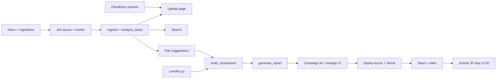

# 04 — Roadmap: 0% → 100% (submitted & deployed)

_Deadline: **Wed 30 Sep 2026, submit by 12:00** (team decision, 00-research §0). Offline round: 1–11 Oct._
_Owners:_
- _**Dev A** = backend (core, pipelines, AI, DB, backend deploy)._
- _**Dev B** = frontend + Cloudinary console + UI + frontend deploy._

_References: HLD features F1–F16 ([01-hld](01-hld.md) §3), LLD sections ([02-lld](02-lld.md))._

Legend: **ONLINE** = must be done for the 30 Sep submission · **OFFLINE** = 1–11 Oct polish.

---

## Day 1 (Thu 24 Sep): start here
**Both (30 min):**
1. `git pull`.
2. Backend: `cd backend && uv sync`. Web: `cd web && pnpm install`.
3. Dev B runs `uv run python scripts/clip_benchmark.py` and commits the result.

**Dev A:**
1. Create the Neon project and put the **direct** URL in `backend/.env` (03 §6.5).
2. Add dependencies: `uv add cloudinary litellm` and `uv add --dev ruff`.
3. Write `migrations/0001_init.sql` (LLD §2) and `scripts/migrate.py`, then run it.
4. `/health` shows `database.status = ok` and `pgvector = true`.
5. Build `core/jobs.py` and `worker.py`, and test them with a dummy job.

**Dev B:**
1. Cloudinary Console: register the AI Content Analysis add-on and **record every add-on quota**.
2. Create the presets `fp_image`, `fp_image_basic` and `fp_video` (LLD §4.1).
3. Open the 3 test URLs (`g_auto`, `e_blur_faces`, `COLLAGE`) and record the results in 06-risks.
4. Web: `pnpm dlx shadcn@latest init`, then `pnpm add next-cloudinary leaflet react-leaflet react-compare-slider`.
5. AppShell with empty routes (03 §3).
6. `lib/api.ts` shows `/health` on the dashboard.

**End of Day 1 (DoD):**
- Web on :3000 shows backend health as green (DB ok).
- Presets exist in Cloudinary.
- The add-on quotas are written down.

---

## Phases and milestones

### P0 · Foundations (24 Sep) · ONLINE
| Task | Owner | Depends on | Definition of done | Test |
|---|---|---|---|---|
| Neon + migrations 0001 | A | — | All LLD §2 tables exist; `vector` extension on | `/health` pgvector=true; `\dt` lists tables |
| Job queue + worker | A | migrations | enqueue→claim→done; retry with backoff; stale-lock reset | pytest with a dummy job that fails twice then succeeds |
| Cloudinary presets + add-on | B | account | 3 presets unsigned; quotas recorded | A manual widget upload shows detection in the Console |
| Web shell + shadcn + health widget | B | — | Sidebar with all routes; health badge | Visual check; `pnpm build` passes |

### P1 · Ingest & analysis (25 Sep) · ONLINE: F1, F2, F3, F4, F5, F7
| Task | Owner | Depends on | Definition of done | Test |
|---|---|---|---|---|
| `cloudinary_gw` + `transforms.py` | A | P0 | Builds all 8 named URLs; `get_resource`; `usage` | Unit test: URL strings match LLD §4.2 |
| `metadata.py` (DMS, date, location rules) | A | — | All LLD §5.2 rules | `test_metadata.py` (S/W sign, 0,0, future date) |
| `embeddings.py` (load once, zero-shot labels_v1) | A | — | Same results as the benchmark | Top-1 ≥ 0.75 on the benchmark set |
| `POST /api/assets/register` + `analyze_asset` pipeline + lineage | A | above | pending → ready with tags, date, location, site | 3 real uploads reach `ready` in < 30 s |
| Projects & sites endpoints | A | P0 | CRUD per LLD §3 | curl / pytest |
| Upload page (2 buttons, CldUploadWidget → register, geolocation, consent) | B | presets, register endpoint | Uploads appear with a status badge that turns ready | Upload 5 photos + 1 video |
| Asset detail page (tags by source, date/location source, manual edit) | B | GET/PATCH asset | Edits persist; `*_source='manual'` | Manual pin on a no-GPS photo |

### P2 · Organise & search (26 Sep) · ONLINE: F6, F8
| Task | Owner | Depends on | Definition of done | Test |
|---|---|---|---|---|
| `GET /api/assets` filters + cursor; timeline; map (rounded coords) | A | P1 | LLD §3 contracts | pytest on filters |
| `search.py` + `POST /api/search` (plain `def`) | A | P1 | Filtered cosine search + tag boost | `test_search.py`: "renewable energy" → solar sample in top 3 |
| Library grid (THUMB, lazy), filters | B | assets list | 60 per page, filters work | Visual check with 50 assets |
| Map (client-only Leaflet, icon fix, attribution) + Timeline | B | map/timeline endpoints | Sites with counts; unassigned markers | Map renders on a hard refresh |
| Search page | B | search endpoint | Results < 1 s, tags shown | 5 demo queries |

### P3 · Before/after (27 Sep) · ONLINE: F9, F10, F11
| Task | Owner | Depends on | Definition of done | Test |
|---|---|---|---|---|
| Pair suggestions (≥ 7 days apart, similarity, framing flag) | A | P1 | Top-3 pairs per site | Our own before/after photos are suggested first |
| `change.py` green_cover v1 + mask upload + `build_comparison` | A | transforms | Rounded delta, masks in Cloudinary, lineage | `test_change.py` synthetic images; real pair looks plausible |
| `core/llm.py` (router, cache, placeholder guard, template fallback) | A | — | Guard rejects digits; fallback always works | `test_llm_placeholders.py`; unplug keys → template text |
| Compare page + comparison page (slider, mask toggle, description) | B | endpoints | Slider aligned; warning shown if framing is off | Visual check on 2 pairs |
| **Checkpoint Sun 27 night:** J1–J4 work end to end | Both | — | — | Run the demo script §§1–4 (05 doc) |

### P4 · Reports, campaign kit, lineage (28 Sep) · ONLINE: F12, F13, F14, F15, F16
| Task | Owner | Depends on | Definition of done | Test |
|---|---|---|---|---|
| `compute_metrics` + `generate_report` + report endpoints | A | P3 | Metrics JSON and grounded summary | Every number in the text exists in the metrics |
| Campaign kit endpoint + credit guard + `/api/usage` | A | transforms | Kit URLs + lineage; 503 above the guard | Force guard=0% → 503 |
| `/api/lineage` | A | lineage rows | Chain for asset, comparison, report, kit | Open any output → source visible |
| Report page + print page (print CSS) + campaign kit UI | B | endpoints | PDF looks right (A4, colours, no split cards) | Chrome "Save as PDF" |
| LineagePanel (Sheet) everywhere + UsageMeter | B | lineage/usage | One click from any image to its source | Click-through on 3 items |

### P5 · Deploy, seed, harden (29 Sep) · ONLINE
| Task | Owner | Depends on | Definition of done | Test |
|---|---|---|---|---|
| Azure for Students VM: API + worker + HTTPS reverse proxy (05 doc) | A | P4 | Public HTTPS `/health` = ok | Call it from a phone |
| Vercel deploy (env vars, rewrite rule if needed) | B | API URL | Public site works end to end | Upload from a phone on mobile data |
| Seed demo data (`seed_demo.py`): project, sites, ~150 photos, 3–5 clips, 2–3 real pairs | Both | deploy | All assets ready; LLM texts cached | Demo script runs with no waiting |
| **Feature freeze 18:00**; record the backup demo video; README; screenshots | Both | — | Video ≤ 3 min covers G1–G6 | Watch once end to end |
| Fallback check: laptop + Cloudflare tunnel runbook tested | A | — | Tunnel URL works with Vercel | Switch `NEXT_PUBLIC_API_BASE_URL` once |

### P6 · Submit (Wed 30 Sep, by 12:00) · ONLINE
Final checklist in [05-deployment-and-submission](05-deployment-and-submission.md) §6. Owner: both. DoD: submission confirmation received.

### P7 · Offline-round polish (1–11 Oct) · OFFLINE
| Task | Owner | Notes |
|---|---|---|
| Judge feedback fixes | Both | First priority |
| Structured metadata write-back (D12) | A | Cloudinary-native bonus |
| Vision change descriptions (Groq, face-blurred) behind a flag | A | Only if quotas allow |
| HNSW index + larger dataset (~1k assets) | A | Scalability story |
| Video transcription / chapters | A | Only if add-on quota verified |
| Better auth (Better Auth), multi-org | B | Only if asked |
| Mobile-friendly upload polish, empty/error states | B | — |
| Offline-venue proofing: `DEMO_MODE`, cached everything, hotspot test | Both | Before 10 Oct |
| Rehearse the demo ×3 | Both | 10 Oct |

---

## Critical path

**Critical path:** migrations → worker → analyze_asset → comparison → report → deploy → seed → submit. **Anything that slips here moves the deadline.**

**Parallel work** (off the critical path):
- all Dev B UI pages, which can be built against mocked JSON until the endpoints land;
- `metadata.py`, `embeddings.py` and `core/llm.py`, which are independent modules;
- the Cloudinary console setup;
- gathering the demo dataset.

**Real before/after photos:** take the "before" shots **today (24 Sep)** and the "after" shots on **27 Sep**, same spot, same angle, location on.

## Cut order if behind (decide at the Sun 27 checkpoint)
Cut from the top of this list first. The items at the bottom are never cut.
1. Video keyframes → images only.
2. Timeline view → date filter only.
3. Campaign quote card → keep the square and story crops.
4. AI change description → template sentence only.
5. Map view → site list.

**Never cut** (these carry the Goal bullets):
- upload + analysis;
- search;
- the before/after slider + metric;
- the report;
- lineage.
