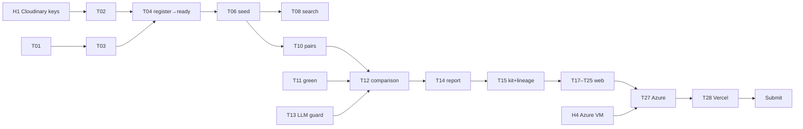

# 04 — Roadmap v2: 27 Sep → submitted 30 Sep 12:00

_Rewritten **Sun 27 Sep 2026, evening**. v1 (5-day plan, P0–P7) slipped ~3 days; it's in git history._
_**Approved by the team on 27 Sep:** (1) **Lean-core scope** (§2); (2) **Sonnet builds everything**, working through the tasks in order (§5); (3) the backend is **deployed on an Azure VM** (§5, Day C)._
_This doc **overrides** 01-hld, 02-lld, 03-project-structure, 05-deployment and getting-started wherever they conflict. For anything this doc doesn't cover, follow 02-lld._

---

## 0. Rules for the AI agent (Sonnet): read this first

1. **Work the tasks in order** (T01 → T30). Each task lists: *Read*, *Build*, *Done when*. Don't start a task until the previous task's *Done when* passes.
2. **Never run git.** The user manages the repo. Don't commit, stash, reset or check out anything.
3. **Every design decision in this doc is already approved.** For anything **not** covered here (a new library, a schema change, a new endpoint, a new page), stop and ask the user with **3 options**, recommended first. Don't guess.
4. **Human-only steps** (🧑 H-tasks, §4) need a person with a browser or an account. If a task depends on a pending H-task, tell the user exactly which H-task is blocking you and what to do, then move on to the next unblocked task.
5. **Don't add dependencies** beyond the ones listed in §3.3.
6. **Run the tests after every backend task:** `cd backend && uv run pytest -q`. They run against the **real Neon DB**, which is already migrated. Keep them green.
7. **Code style:** match the existing code. Use raw SQL via `sqlalchemy.text()` (the codebase has **no ORM models**: don't create `models.py`). Route handlers that touch CLIP, Pillow or the DB are plain `def`, never `async def`.
8. **Next.js is v16.** Before using any Next API you're unsure of, read the bundled docs in `web/node_modules/next/dist/docs/`. Your training data may be older. See the gotchas in §6.
9. **Cloudinary calls are rationed.** Read §3.4 before touching anything Cloudinary. Only the calls in its inventory table are allowed. Never call Cloudinary in a loop, on a timer, on page load or from `/health`.
10. At the end of each task, tell the user in 2–3 lines what now works and how to see it.

---

## 1. Where we are (verified 27 Sep, 19:45)

| Area | State |
|---|---|
| Neon DB | ✅ Connected, `pgvector` on, `0001_init.sql` applied, **0 projects/assets** |
| `backend/.env` | ✅ `DATABASE_URL`, `CLOUDINARY_URL` (**your own account, cloud `dx4cdhvcp`, Master Admin key**) and `HF_HUB_OFFLINE` are set. ⚠️ `GEMINI_API_KEY`, `GROQ_API_KEY` and `CEREBRAS_API_KEY` are empty → H2 (optional) |
| CLIP models | ✅ Downloaded to `backend/models/` |
| `app/core/` | ✅ `config.py`, `db.py` (`get_engine`, `get_session`, `session_scope`, `check_database`), `jobs.py` (enqueue/claim/complete/fail/requeue/reset_stale_locks), `errors.py` (`ApiError`, `RetryableError`, `PermanentError`) |
| `app/worker.py` | ✅ Poll loop, retries, `@handler` registry. Only `analyze_asset` (+ `dummy`) is registered |
| `app/fieldproof/` | ✅ `cloudinary_gw`, `transforms`, `embeddings`, `metadata`, `sites`, `lineage`, `pipelines.analyze_asset`. ❌ Missing: `schemas.py`, `routes.py`, `search.py`, `change.py`, `reports.py`, `core/llm.py` |
| API | ❌ Only `GET /health`. **No `/api/*` routes** |
| `analyze_asset` | ⚠️ Written but **never run against a real Cloudinary upload** |
| Tests | ✅ 9 passing (health, jobs, metadata, transforms) |
| Cloudinary presets | ❌ None of ours exist (only Cloudinary's default `ml_default`) → T02 creates all 3 |
| `web/` | ❌ Stock create-next-app page. No shadcn, next-cloudinary or slider installed |
| Deploy | ❌ Nothing deployed |
| Demo photos | 14 Wikimedia samples in `backend/samples/public/` (their EXIF has **no GPS/date**, so the seed script places them). ❓ No own before/after photos confirmed → H3 |

### 1.1 Verified against the real Cloudinary account `dx4cdhvcp` (27 Sep, re-checked after switching to our own account). Treat these as facts
| # | Fact | Consequence |
|---|---|---|
| V1 | Plan **Free**, folder mode **dynamic**, credits `0.16 / 25`. The API key has the **Master Admin** role (a "Media Library User" key can't upload or read usage) | Plenty of headroom |
| V2 | `cloudinary.api.usage()["credits"]` = `{"usage": 0.16, "limit": 25.0, "used_percent": 0.64}`. **`used_percent` is already in percent** (0.64 = 0.64 %) | T15: compare `used_percent` directly with `settings.credit_guard_percent` (80) |
| V3 | **The AI Content Analysis add-on is NOT active.** Any upload with `detection=` fails the **whole upload**: `"You don't have an active subscription for Cloudinary AI Content Analysis"` | T02 must **not** put `detection`/`auto_tagging` into `fp_image` unless the add-on probe succeeds. Detection tags are a bonus; the app must work fully without them |
| V4 | `g_auto`, `e_blur_faces`, `COLLAGE` (side by side, checked visually) and `QUOTE_CARD` text layers all return **200** with the current `transforms.py` | Keep `ENABLE_G_AUTO=true` and `ENABLE_BLUR_FACES=true`. The COLLAGE chain is correct |
| V5 | `cloudinary.config(cloudinary_url=…)` **does NOT configure the SDK** (cloud_name stays `None`). This is what `cloudinary_gw._configure()` does today, so **every Cloudinary call in the app currently fails** with "Must supply cloud_name" | Fixed in T01 |
| V6 | The **Admin API** `api.resource(..., media_metadata=True)` returns EXIF under the key **`media_metadata`**. Only the **upload** response calls it `image_metadata`. `pipelines.analyze_asset` reads `resource.get("image_metadata")`, so it **never sees EXIF** | Fixed in T01 |
| V7 | EXIF comes back as flat strings: `"DateTimeOriginal": "2026:09:20 10:30:00"`, `"OffsetTimeOriginal": "+05:30"`, `"GPSLatitude": "12 deg 58' 12.30\" N"`, `"GPSLatitudeRef": "North"`. `metadata.parse_media_metadata({"image_metadata": <that dict>}, …)` parses it **correctly** (tested: 12.9701, 77.5944, 05:00 UTC) | No change needed in `metadata.py` |

---

## 2. Scope (lean core, approved 27 Sep)

### ✅ IN: must work on the live URL by 30 Sep
| Feature | Notes |
|---|---|
| F1 Upload | **Photos only** in the UI (one button, preset `fp_image`). The video code path stays but isn't exposed or tested |
| F2–F5 Analysis | CLIP tags, Cloudinary detection tags (if the add-on works), EXIF date/GPS, auto site assignment |
| F5 Projects & sites | Sites are managed as a **list with lat/lng number inputs** (no map) |
| F6 Library | Grid + filters (site, tag, status) |
| F8 Search | Semantic + filters |
| F9–F10 Before/after | Pair suggestions, slider, green-cover %, mask toggle, framing warning |
| F11 Change description | LLM sentence with **template fallback**. It must work with **no LLM keys at all** |
| F12 Report | Web view + print-to-PDF page. LLM summary with template fallback |
| F13 Campaign kit | `SQUARE` + `STORY` + `COLLAGE` only |
| F14 Lineage | `/api/lineage` + LineagePanel drawer on asset, comparison, report and kit items |
| F15 Privacy | `e_blur_faces` on compare/kit derivatives (if it works on Free, see T05); GPS rounded to 3 dp in API responses |
| Credit guard | Backend only (T15); no usage-meter UI |
| Credits page | `/credits` lists the Wikimedia sources (licence requirement) |

### ❌ OUT (don't build; mention as "roadmap" in the README)
Map view (Leaflet) · Timeline · Video upload/keyframes in the UI · Quote card · Usage-meter page (`/admin/usage`) · CI workflow · Structured-metadata write-back · Auth · `DEMO_MODE` beyond the minimal version in T16.

### Changes from 02-lld (all approved with the scope)
- **Display URLs are built by the backend only.** Every API response includes the ready-made Cloudinary URLs (`thumb_url`, `compare_url`, …). The frontend never builds transformations, so **no `web/lib/transforms.ts`** and no `CldImage`. Use plain ``.
- **No `leaflet`, `react-leaflet` or timeline code.**
- **No ORM (`models.py`).** Raw SQL, as in the existing code.

---

## 3. Reference: contracts Sonnet must follow exactly

### 3.1 API response shapes (JSON, snake_case)
```ts
// Shared types: mirror these in web/lib/types.ts
Project      = { id, name, description, started_on /*YYYY-MM-DD|null*/, created_at,
                 asset_count, ready_count, failed_count, site_count }
Site         = { id, project_id, name, lat, lng, radius_m, asset_count }
Tag          = { tag, source /*'clip'|'cld_detection'|'manual'*/, score /*number|null*/, rank /*1-3|null*/ }
AssetCard    = { id, project_id, site_id, site_name, status /*'pending'|'processing'|'ready'|'failed'*/,
                 resource_type, thumb_url, captured_at, tags: Tag[] /* clip rank-1..3 first, then detection, then manual */ }
AssetDetail  = AssetCard & { cld_public_id, cld_version, secure_url, compare_url, width, height,
                 captured_at_source, lat_r, lng_r /* rounded 3 dp or null */, location_source,
                 consent_confirmed, error }
SearchHit    = { asset: AssetCard, score }
PairSuggestion = { before: AssetCard, after: AssetCard, image_similarity, framing_warning, days_apart }
Comparison   = { id, site_id, site_name, status, before: AssetCard, after: AssetCard,
                 before_compare_url, after_compare_url, before_mask_url, after_mask_url,
                 image_similarity, framing_warning, before_green_pct_rounded, after_green_pct_rounded,
                 delta_green_pct_rounded, days_apart, description, description_model, created_at }
Report       = { id, project_id, status, date_from, date_to, metrics: object,
                 summary: { headline: string, paragraphs: string[], highlights: string[] } | null,
                 summary_model, items: ReportItem[], created_at }
ReportItem   = { position, kind /*'asset'|'comparison'*/, section, asset: AssetCard|null, comparison: Comparison|null }
KitItem      = { kind /*'social_square'|'social_story'|'collage'*/, url, source_asset_ids: string[], transformation }
LineageRecord = { id, entity_type, entity_id, output_kind, output_ref, source_asset_ids, source_public_ids,
                  source_versions, tool, transformation, model, params, created_at }
Error        = { error: { code, message, details } }
```
- Percentages are shown rounded to **5**: `5 * round(x / 5)`.
- `lat`/`lng` of **assets** are **never** returned at full precision. Only `lat_r`/`lng_r` (3 dp). Site lat/lng are returned in full (sites are ours, not personal data).

### 3.2 Endpoints (in scope)
| Method & path | Task |
|---|---|
| `GET /health` | exists |
| `GET/POST /api/projects`, `GET /api/projects/{id}` | T03 |
| `GET/POST /api/projects/{id}/sites`, `PATCH /api/sites/{id}` | T03 |
| `POST /api/assets/register` → `202 {asset_id, status, job_id}`; duplicate `public_id` → `200` with the existing `asset_id` (idempotent, not an error). Body also accepts the optional `image_metadata: dict` and `detection: dict` from the upload result (§3.4 C1/C3) | T04 |
| `GET /api/assets?project_id&site_id&tag&status&cursor&limit≤60` → `{items: AssetCard[], next_cursor}` | T04 |
| `GET /api/assets/{id}`, `PATCH /api/assets/{id}`, `POST /api/assets/{id}/reprocess` | T04 |
| `GET /api/jobs/{id}` | T04 |
| `POST /api/search` (plain `def`) | T09 |
| `GET /api/sites/{id}/pair-suggestions` | T10 |
| `POST /api/comparisons`, `GET /api/comparisons/{id}`, `GET /api/sites/{id}/comparisons`, `GET /api/projects/{id}/comparisons?status=` | T12 |
| `POST /api/reports`, `GET /api/reports/{id}`, `GET /api/projects/{id}/reports` | T14 |
| `GET /api/reports/{id}/campaign-kit` | T15 |
| `GET /api/lineage?entity_type&entity_id` | T15 |

### 3.4 Cloudinary call budget: every call the app makes (HARD RULES)

Cloudinary has three kinds of cost. **Each call happens once, when it's really needed, and never in a loop, on a timer, or per page view.**

| Kind | Limit on our Free plan | What counts |
|---|---|---|
| **Admin API** (`cloudinary.api.*`) | **500 calls / hour**, rolling. Going over → HTTP 420 for the rest of the hour | Every `api.resource`, `api.usage`, `api.*_upload_preset`, `api.delete_resources` call |
| **Upload API** (`cloudinary.uploader.upload`, the browser widget) | No hourly limit we'll hit; uses storage + credits | Each file uploaded |
| **Delivery / transformations** (opening a `res.cloudinary.com/...` URL) | 25 credits / month total (1 credit ≈ 1,000 new transformations or 1 GB). Account **disabled** if exceeded | Only the **first** request for each **unique** transformation URL creates a derivative. After that it's served from CDN cache (bandwidth only) |

**Building a URL** (`cloudinary_gw.url()` / `cloudinary.utils.cloudinary_url`) is **local string building**: zero network, zero cost. Do it freely.

#### Complete inventory: this is the ONLY Cloudinary traffic allowed
| # | Where | Call | Kind | How often | Rule |
|---|---|---|---|---|---|
| C1 | Browser upload page (T20) | Widget unsigned upload | Upload | 1 per photo | The widget sends the upload result (incl. `image_metadata`, and `info.detection` if the add-on is on) to our `/api/assets/register` |
| C2 | `seed_demo.py`, `smoke_upload.py` (T04, T06, T16) | `uploader.upload` signed | Upload | 1 per file, **once ever** (skips existing public_ids by checking **our DB**, not Cloudinary) | Pass `image_metadata=resp.get("image_metadata") or {}` (an **empty dict, not None**, so the worker never falls back to C3 for photos without EXIF) + `detection=(resp.get("info") or {}).get("detection")` to `register_asset` |
| C3 | `analyze_asset` (worker) | `api.resource(public_id, media_metadata=True)` | **Admin** | **Only if** the asset row has **no stored `media_metadata`**, i.e. the uploader didn't send it. Normally **0 calls** | On reprocess, reuse the stored `media_metadata`/`cld_detection`. Never call it again |
| C4 | `analyze_asset` (worker) | Download the `ANALYSIS` URL | Delivery | 1 per asset analysis | Only the worker. 1 derivative per asset |
| C5 | `build_comparison` (worker) | Download 2 × `COMPARE` URLs | Delivery | 2 per comparison | Same URLs the slider shows, so no extra derivatives |
| C6 | `build_comparison` (worker) | `uploader.upload` of 2 mask PNGs | Upload | 2 per comparison | `overwrite=True` with a fixed public_id, so re-runs replace instead of piling up |
| C7 | Campaign-kit endpoint (T15) | `api.usage()` for the credit guard | **Admin** | **At most once per 10 min** (in-process cache); only when the kit endpoint is called | Never on any other endpoint, never on startup, never in `/health` |
| C8 | Browser: library, asset, compare, report, kit pages | `` of URLs built by the backend | Delivery | First view of each unique URL creates it; later views are free (CDN) | **Only the named transforms** (THUMB, COMPARE, SQUARE, STORY, COLLAGE). No per-request params, no cache-busters, no `next/image` optimiser |
| C9 | `setup_cloudinary.py` (T02) | Add-on probe upload + `api.*_upload_preset` + `api.delete_resources` | Admin + Upload | ~8 Admin calls, **run once** (re-run only if the settings change) | Manual script, never imported by the app |
| C10 | `check_transforms.py` (T05) | GET 5 URLs | Delivery | Manual, deploy day only | — |

**Forbidden:** calling Cloudinary from `/health`; listing resources (`api.resources`, `api.resources_by_*`, search API); polling Cloudinary for status (poll **our** API instead); calling `api.resource` from any HTTP route; building URLs with transformations not in `transforms.py`.

#### Safety net (built in T01)
`cloudinary_gw` keeps an in-process counter of Admin API calls over a rolling hour. At **300 calls/hour** (60 % of the limit) it stops making Admin calls:
- the worker path raises `RetryableError("admin api budget")`, so the job retries later;
- `usage()` returns the last cached value, or `None` (the guard fails open).

It logs a warning at 200. Every Admin call is logged at INFO with its name, so the log shows exactly what was used.

#### Expected totals for the whole hackathon
~100 uploads (70 seed + ~30 live) → **~0–100 Admin calls in total** (0 if C3 is skipped as designed), ~300 new derivatives (THUMB + ANALYSIS + COMPARE per asset) + ~20 for kits + ~10 masks ≈ **0.4 credit**. We're at 0.17 / 25 now.

### 3.3 Allowed dependencies
- **Backend:** already in `pyproject.toml` (cloudinary, fastapi, fastembed, httpx, litellm, numpy, pgvector, pillow, pillow-heif, psycopg, pydantic-settings, sqlalchemy, uvicorn, pytest, ruff). **Add nothing.**
- **Web:** `next-cloudinary`, `react-compare-slider`, plus shadcn/ui (via its CLI) and whatever the shadcn components pull in (`lucide-react`, radix, etc.). **Nothing else.**

---

## 4. 🧑 Human tasks (Sonnet cannot do these)

| # | When | Who | Task | Unblocks |
|---|---|---|---|---|
| **H1** | ✅ keys done 27 Sep. **Add-on: now** | Either | ~~`CLOUDINARY_URL` in `backend/.env`~~ ✅ done (our own account, cloud name `dx4cdhvcp`, Master Admin key). **Still to do:** Console → *Add-ons* → find **"Cloudinary AI Content Analysis"** → register its **free** plan, if one is offered, and write down the monthly quota. If there's no free plan, skip it: the app works without detection tags (V3). Tell Sonnet either way before T02. | T02 (detection on/off) |
| **H2** | 27–28 Sep | Either | **LLM keys (optional; the app works without them).** Google AI Studio → API key → `GEMINI_API_KEY`. console.groq.com → `GROQ_API_KEY`. Open https://ai.google.dev/gemini-api/docs/models, copy the exact current **Flash-Lite** model ID, and set `GEMINI_MODEL=gemini/<that id>` in `backend/.env`. | T13 (real text instead of the template) |
| **H3** | **28 Sep, daylight** | Either | **Before/after photos (hero demo).** Pick 1 spot with plants (garden, park strip, potted plants). **Location ON** in the phone camera. Take a "before" shot, then change the scene visibly (add or remove plants, or water and rearrange pots). Take the "after" shot from the **same spot and angle**. Take 3–4 such pairs. Copy them to `backend/samples/mine/`. ⚠️ Pairs need **≥ 7 days apart** in `captured_at`, but you only have 1 day. **Sonnet handles this in T16** by seeding the "before" set with a manual `captured_at` 8+ days earlier. The pair is clearly labelled as a staged demo in the README. | T16 |
| **H4** | **28 Sep** | Either | **Azure VM.** portal.azure.com (Azure for Students) → *Create a virtual machine*: Ubuntu Server 24.04 LTS **x64**; size **Standard_B2s (2 vCPU, 4 GiB)** or larger (the free 750 h sizes have ~1 GiB, too small for CLIP in 2 processes; **confirm the RAM shown in the size picker is ≥ 4 GiB**); authentication = SSH public key (`~/.ssh/id_ed25519.pub` from this machine; create one with `ssh-keygen -t ed25519` if missing); inbound ports **22, 80, 443**; region: the closest to India offered. After creation: *Networking* → public IP → *Configuration* → set a **DNS name label** (e.g. `fieldproof-api`), giving `fieldproof-api.<region>.cloudapp.azure.com`. Give Sonnet: the username, IP and DNS name. | T27 |
| **H5** | 29 Sep | Either | **Vercel.** vercel.com → *Add New Project* → import the repo → **Root Directory `web`** → env vars from T28 → Deploy. Give Sonnet the `https://….vercel.app` URL. | T28 |
| **H6** | 29 Sep, after freeze | Both | Record the **≤ 3 min demo video** (script in 05 §4, minus map/timeline) → YouTube unlisted or Drive → link. | T30 |
| **H7** | 30 Sep, by 12:00 | Either | Make the repo accessible to the judges, fill in the official submission form, save a screenshot of the confirmation. **Check that the repo has no secrets:** `.env` must never have been committed. **Now, not later:** the friend who owns the **old** Cloudinary account (`zruociie`) should revoke that API key, because its secret was pasted into a chat on 27 Sep. It's no longer used anywhere. Our current key (`dx4cdhvcp`) was never shared. | — |

---

## 5. Task list

Estimated times assume Sonnet in Claude Code with a human approving prompts. **Day A = Sun 27 night · Day B = Mon 28 · Day C = Tue 29 · Day D = Wed 30 morning.**

### Day A (27 Sep night): backend spine, first real upload

#### T01 · Fix known bugs in existing code (45 min)
*Read:* `app/fieldproof/pipelines.py`, `app/worker.py`, `app/fieldproof/lineage.py`.
*Build:*
1. **Manual edits must survive reprocess.** In `analyze_asset`, if `row["location_source"] == 'manual'`, don't overwrite `lat`, `lng`, `location_source` or `site_id`. If `row["captured_at_source"] == 'manual'`, don't overwrite `captured_at` or `captured_at_source`.
2. **Device location.** Take `device_lat`/`device_lng` **only** from the job payload (`payload.get("device_lat")`). Remove the fallback to `row["lat"]`. T04 puts them in the payload.
3. **Stuck in 'processing'.** When a job fails for good (retries exhausted, or `PermanentError`), its entity must be marked `failed`. Implement this in `worker.py`: after `fail(job.id, …)`, call an optional per-kind `on_final_failure(payload, error)` hook. Register hooks for `analyze_asset` (→ `assets.status='failed'`), `build_comparison` (→ `comparisons.status='failed'`) and `generate_report` (→ `reports.status='failed'`). Put the SQL for each in `pipelines.py`.
4. **Lineage idempotency.** Add `lineage.delete_for(entity_type, entity_id, output_kinds: list[str])`. Call it in `analyze_asset` before recording `analysis`/`embedding`/`tags`, so reprocessing doesn't duplicate rows.
5. **Worker handler registration.** Replace `register_analyze_handler()` with `register_handlers()`, which imports and registers `analyze_asset`, `build_comparison` and `generate_report`. Guard the latter two with `hasattr` until T12/T14 add them.
6. **Cloudinary SDK config (V5).** In `cloudinary_gw._configure()`, replace `cloudinary.config(cloudinary_url=…)` with:
   ```python
   import os
   os.environ["CLOUDINARY_URL"] = settings.cloudinary_url
   cloudinary.reset_config()
   cloudinary.config(secure=True)
   ```
   Also fix `url()`: when `CLOUDINARY_URL` **is** set, it must call `_configure()` (it already does). When it isn't set, keep the `demo` fallback.
7. **EXIF key (V6).** In `analyze_asset`, replace `image_metadata = resource.get("image_metadata") or {}` with `image_metadata = resource.get("media_metadata") or resource.get("image_metadata") or {}`, and call `metadata.parse_media_metadata({"image_metadata": image_metadata}, …)`. **Don't** spread `**resource` into it.
8. **Admin API budget (§3.4 safety net).** In `cloudinary_gw`, add a module-level `deque` of timestamps and a helper `_admin_call(name, fn, *a, **kw)` that drops entries older than 1 h. At ≥ 300 entries it raises `RetryableError("admin api budget")`; at ≥ 200 it logs a warning. Every call logs `cloudinary admin call: <name>` at INFO. Route **all** `cloudinary.api.*` calls in `cloudinary_gw` (`get_resource`, `usage`) through it. Test: `tests/test_cloudinary_budget.py` monkeypatches the deque to 300 entries → `RetryableError`, with no network.
9. **Skip the Admin call when metadata is already stored (§3.4 C3).** In `analyze_asset`: if `row["media_metadata"]` is not `None`, use it (and `row["cld_detection"] or {}`) and **don't** call `cloudinary_gw.get_resource`. Only call it when `media_metadata` is `None`, and then store what it returns, so it's never called twice for the same asset.

*Done when:* `uv run pytest -q` is green, including two new tests:
- `tests/test_worker_final_failure.py`: a dummy kind that always raises `PermanentError` → the hook is called once.
- `tests/test_cloudinary_config.py`: with `settings.cloudinary_url = "cloudinary://k:s@mycloud"` (monkeypatch), after `_configure()`, `cloudinary.config().cloud_name == "mycloud"`. Reset `cloudinary_gw._configured = False` before and after.

**Live check:** `uv run python -c "from app.fieldproof import cloudinary_gw as g; print(g.usage()['credits'])"` prints the credits dict.

#### T02 · Cloudinary setup script (30 min)
*Build:* `backend/scripts/setup_cloudinary.py`. It's idempotent: for each preset, try `cloudinary.api.update_upload_preset(name, **settings)`, and if that raises "not found", use `create_upload_preset(name=name, **settings)`. Configure the SDK with the T01 `_configure()`.
1. **Probe the add-on first:** upload `samples/public/Mangrove_plantation.jpg` signed with `public_id="fp_probe"`, `overwrite=True`, `detection="coco_v2"`.
   - If it raises and the message contains "subscription", set `addon = False`.
   - If it succeeds, set `addon = True` and **print the full `info` node** (this confirms the detection result path for `pipelines._detection_tags`).
   - Delete `fp_probe` afterwards with `cloudinary.api.delete_resources(["fp_probe"])`.
2. **Presets:**
   - Common settings for all image presets: `unsigned=True`, `asset_folder="fieldproof/originals"`, `use_filename=False`, `unique_filename=True`, `overwrite=False`, `allowed_formats="jpg,jpeg,png,webp,heic"`, `media_metadata=True`, `transformation=[{"crop":"limit","width":4000,"height":4000}]` (no `f_auto`: it's forbidden in incoming transformations).
   - `fp_image_basic` = the common settings.
   - `fp_image` = the common settings **plus `detection="coco_v2"` and `auto_tagging=0.6` ONLY IF `addon`**. Otherwise it's identical to basic. **The web always uses `fp_image`**, so turning the add-on on later just means re-running this script.
   - `fp_video`: `unsigned=True`, `asset_folder="fieldproof/originals"`, `allowed_formats="mp4,mov"`, `media_metadata=True` (created for later; not used by the UI).
3. Print each preset back with `cloudinary.api.upload_preset(name)["settings"]`, plus one line `ADDON DETECTION: ON|OFF`.

*Done when:* the script runs twice without error, prints 3 presets, and `ADDON DETECTION` matches what the user reported for H1.

#### T03 · API foundation + projects & sites (1 h)
*Build:*
- `app/fieldproof/schemas.py`: Pydantic request models (`ProjectCreate`, `SiteCreate`, `SitePatch`, `AssetRegister`, `AssetPatch`, `SearchRequest`, `ComparisonCreate`, `ReportCreate`). Validation: `lat ∈ [-90,90]`, `lng ∈ [-180,180]`, `radius_m ∈ [20, 5000]`, `limit ≤ 60`.
- `app/fieldproof/routes.py`: one `APIRouter(prefix="/api")`. You may split it into `routes_*.py` files if it grows past ~400 lines.
- `app/main.py`: `include_router`. Add an exception handler for `ApiError` → the §3.1 error envelope. Add a `RequestValidationError` handler → `422 VALIDATION_ERROR` envelope with `details=exc.errors()`. Anything else unexpected → `500 INTERNAL` envelope (log the traceback).
- Projects and sites endpoints per §3.2, with the counts in §3.1. `POST` generates the `uuid4` in Python.

*Done when:* `tests/test_api_projects.py` (FastAPI `TestClient`) creates a project and a site, lists them with counts, gets a 404 envelope on an unknown ID, and gets 422 on `lat=999`. Tests clean up the rows they create.

#### T04 · Assets API + register → worker, end to end (1.5 h)
*Build:*
- `app/fieldproof/urls.py`: the **only** place display URLs are built. `thumb_url(row)`, `compare_url(row)`, `analysis_url(row)` wrap `cloudinary_gw.url(...)` with the named transforms.
- `POST /api/assets/register`: validate that the project exists. `INSERT … ON CONFLICT (cld_public_id) DO NOTHING RETURNING id`. Store the optional `image_metadata` → `assets.media_metadata` and `detection` → `assets.cld_detection` from the request (see §3.4 C1–C3: this is what lets the worker skip the Admin API). On conflict, return `200 {asset_id: <existing>, status, job_id: null}`. Otherwise `enqueue("analyze_asset", {"asset_id", "device_lat", "device_lng"})` → `202`. Put the logic in a plain function `register_asset(...)` in `app/fieldproof/assets.py` so the **seed script can call it without HTTP**.
- `GET /api/assets` with keyset pagination on `(created_at DESC, id DESC)`. `cursor` = base64 of `"<iso>|<uuid>"`. Filters: `project_id` (required), `site_id`, `tag` (EXISTS on `asset_tags`), `status`.
- `GET /api/assets/{id}` → `AssetDetail`. Tags ordered: clip by rank, then detection by score desc, then manual.
- `PATCH /api/assets/{id}`: `site_id`, `captured_at` (→ `captured_at_source='manual'`), `lat`+`lng` together (→ `location_source='manual'`; and if `site_id` isn't given, re-run `sites.assign_site`), `add_tags`/`remove_tags` (source `manual`; lowercase, trimmed).
- `POST /api/assets/{id}/reprocess` → enqueue → `202 {job_id}`.
- `GET /api/jobs/{id}`.

*Done when:* **live check.** Run API + worker (two terminals, §7), then run a small script `scripts/smoke_upload.py` that uploads `samples/public/Mangrove_plantation.jpg` **signed** with `upload_preset="fp_image"` (let Cloudinary pick the public_id) and calls `register_asset(...)` with the upload result + a test project (create "Smoke test" if missing). Within ~30 s, `GET /api/assets/{id}` shows `status: ready`, 3 clip tags, and a `thumb_url` that opens in a browser. Paste the JSON to the user.

#### T05 · Transform smoke script (15 min)
The transforms are already verified on this account (V4). This task only adds a reusable check for deploy day.
*Build:* `backend/scripts/check_transforms.py <public_id> [<after_public_id>]`: builds `THUMB`, `COMPARE`, `SQUARE`, `STORY` and `COLLAGE` via `cloudinary_gw.url`, `GET`s each one, and prints the status + the `x-cld-error` header.

*Done when:* running it on the T04 asset prints 5 × 200. Use the T04 asset as both the before and after for COLLAGE.

### Day B (Mon 28 Sep): the rest of the backend

#### T06 · Seed script v1 + more samples (1 h)
*Build:*
- `backend/scripts/fetch_more_samples.py`: extend the Wikimedia download logic from `scripts/clip_benchmark.py` to fetch **~5 more images per label** (11 labels). Write `samples/public/labels.json` = `{filename: label}` covering **all** files, including the 14 existing ones (their labels are in the `SAMPLES` list in `clip_benchmark.py`). The seed script reads this file. Only CC0/PD/CC BY/CC BY-SA. Append the rows to `samples/public/CREDITS.md` in the same format. Max ~2 MB per file (use the Commons `thumburl` with `iiurlwidth=1600`).
- `backend/scripts/seed_demo.py` (idempotent: re-running skips existing public_ids):
  1. Create or reuse the project **"Green Neighbourhood Initiative"** (`started_on` = 2026-01-01).
  2. Create 4 sites spread across India with hand-picked coordinates (e.g. Bengaluru, Chennai coast, Sundarbans, Rajasthan), `radius_m=5000`.
  3. For each file in `samples/public/`: signed upload with `upload_preset="fp_image"`, `public_id="seed_" + <slug of filename>`, then `register_asset(...)` with the upload response's `image_metadata` and `info.detection` (§3.4 C2), passing device lat/lng = **a random point within 1 km of** the site whose theme matches the image's label (dict label → site). The Wikimedia files have **no GPS** (verified), so this is what places them. All site coordinates must be inside India, otherwise `resolve_location` rejects them.
  4. Wait until all assets are `ready` or `failed` (poll the DB every 2 s, with a 10 min timeout). Print a summary.

*Done when:* ~60–70 assets are `ready`, and failures are 0 or explained.

#### T07 · Label check (15 min)
Run a quick SQL: rank-1 clip tag vs. the expected label, for the seeded Wikimedia set. Report accuracy to the user. **Don't retune labels** unless it's below 0.6; if it is, ask the user.

#### T08 · Search module (1 h)
*Build:* `app/fieldproof/search.py` with `search(req) -> list[SearchHit]`, using the SQL in 02-lld §5.4 (pass the vector as a `'[…]'` literal cast to `vector(512)`, like `pipelines._vec_literal`).
- Tag boost +0.03 when a lowercase query word equals a tag.
- Empty query → browse mode ordered by `captured_at DESC`.
- Filters are optional.

*Done when:* `tests/test_search.py` (marked `@pytest.mark.integration`; skipped if there are no ready assets) confirms that "solar panels on a field" returns a solar sample in the top 3, and "kids studying" returns the classroom sample in the top 3.

#### T09 · Search endpoint + model warm-up (20 min)
- `POST /api/search` (plain `def`).
- In `main.py`, add a lifespan hook that warms the text model in a background thread (`embeddings.embed_text("warm up")`), wrapped in try/except so a missing model never crashes the API.

*Done when:* the first real query answers in < 1 s after startup.

#### T10 · Pair suggestions (45 min)
`GET /api/sites/{id}/pair-suggestions`:
- Take `ready` images at the site with `captured_at` not null.
- Form every pair (earlier = before) with `days_apart ≥ 7`.
- `image_similarity` = dot product of their `frame_s=0` embeddings (compute it in SQL with `1 - (a.embedding <=> b.embedding)`).
- Return the **top 3 by similarity**, with `framing_warning = similarity < settings.framing_sim_threshold`.
- Return `[]` if there are none.

*Done when:* a pytest with 2 synthetic asset rows + embeddings inserted directly returns 1 pair (clean up afterwards).

#### T11 · Green-cover module (1 h)
*Build:* `app/fieldproof/change.py`:
- `green_cover(img) -> GreenResult(pct: float, mask_png: bytes)`, algorithm v1 exactly as 02-lld §5.5 step 2, with numpy. Use `settings.green_exg_threshold`.
- The mask image: green pixels tinted bright green at 60% opacity over the original; other pixels darkened to 40% brightness; the excluded top 30% greyed out.
- `round5(x)`.

*Done when:* `tests/test_change.py` covers an all-green synthetic image (≈100%), an all-grey one (0%), and one with the top 30% green sky and a grey bottom (0%, proving the sky exclusion).

#### T12 · Comparisons: job + endpoints (1.5 h)
*Build:*
- `POST /api/comparisons` validates: the site exists, both assets are `ready` **images**, both are at that site, and `before ≠ after`. It computes `image_similarity` + `framing_warning`, inserts the comparison as `pending`, and enqueues `build_comparison`.
- `pipelines.build_comparison(payload)` follows 02-lld §5.5 steps 1–6:
  - download both `COMPARE` URLs;
  - `green_cover` ×2;
  - upload both masks with `cloudinary_gw.upload_derived(io.BytesIO(png), folder="fieldproof/derived/masks", public_id=f"{comparison_id}_before"` (and `_after`)`, overwrite=True)`. Store **`result["public_id"]`** exactly as returned in `before_mask_public_id`/`after_mask_public_id`, and build the mask display URL from it with `cloudinary.utils.cloudinary_url(public_id, secure=True, transformation=[{"fetch_format":"auto","quality":"auto"}])`;
  - `delta_rounded`;
  - the description via `core/llm.py` (T13). Until T13 exists, use the template directly;
  - set `ready`;
  - lineage records for `compare` ×2, `mask` ×2 (`params={"algorithm":"green_v1","exg":…,"brightness":[20,240],"roi":"bottom70"}`), and `ai_text`.
- `GET /api/comparisons/{id}` → `Comparison` (§3.1). `GET /api/sites/{id}/comparisons` and `GET /api/projects/{id}/comparisons?status=ready` → `Comparison[]` (the second one feeds the "New report" dialog in T19).

*Done when:* on two seeded images at the same site (manually `PATCH` one's `captured_at` 10 days earlier), the comparison reaches `ready` with mask URLs that open.

#### T13 · Grounded LLM gateway (1 h)
*Build:* `app/core/llm.py` (**no fieldproof imports**):
- `generate_text(task: str, prompt: str, placeholders: dict[str, str|int|float], schema: type[BaseModel], template: BaseModel) -> tuple[BaseModel, str]`, where the returned `str` is `model_used` (`"template"` if the fallback was used).
- Flow:
  1. Check `llm_cache` (key = sha256 of task + model chain + prompt + sorted placeholders JSON). On a hit, return the cached result.
  2. If **no** API keys are configured → return the template immediately.
  3. Otherwise build the chain **from the keys that exist**, in this order: `settings.gemini_model` (if `GEMINI_API_KEY`), `groq/openai/gpt-oss-20b` (if `GROQ_API_KEY`), `cerebras/gpt-oss-120b` (if `CEREBRAS_API_KEY`). Call `litellm.completion(model=chain[0], fallbacks=chain[1:], response_format=schema, num_retries=2, timeout=20, messages=[…])`. Wrap it in try/except: **any** exception → template. The app must never fail because of the LLM.
  4. **Guard:** after removing `{name}` tokens, every string field must contain **no digit** (`re.search(r"\d", …)`), and every `{name}` used must exist in `placeholders`. On failure, retry once, then fall back to the template.
  5. Fill the placeholders with `str.format_map`, store the result in the cache, and return it.
- Wire it into `build_comparison`:
  - task `change_description`, schema `{sentence: str}`;
  - placeholders `{before}`, `{after}`, `{delta}`, `{days}`, `{site}`;
  - template: `"At {site}, estimated green cover changed from {before}% to {after}% ({delta} points) over {days} days."`. Pass `delta` as an **already-signed string** (`f"{d:+d}"`, e.g. `"+15"`, `"-5"`, `"+0"`). Use plain `{name}` placeholders only, never format specs.

*Done when:* `tests/test_llm_guard.py` checks that the guard rejects "grew by 12%" and accepts "grew by {delta}%", and that with no keys the template comes back and `model_used == "template"`.

#### T14 · Reports: job + endpoints (1.5 h)
*Build:* `app/fieldproof/reports.py` + `pipelines.generate_report`:
- `compute_metrics(conn, project_id, date_from, date_to, comparison_ids)` in SQL only, per 02-lld §5.6 step 1. Returns a JSON-safe dict: `assets_total`, `images`, `videos`, `sites_with_evidence`, `first_capture`, `last_capture`, `top_activities: [{tag, count}]` (top 5 rank-1 clip tags), `detections: [{tag, count}]` (top 5), `comparisons: [{id, site_name, delta_green_pct_rounded, days_apart}]`.
- Evidence items: for each top activity, the 2 highest-scoring assets (section `activities`), plus each comparison (section `before_after`). Insert them into `report_items` in order.
- Summary via `llm.generate_text`:
  - task `report_summary`, schema `{headline: str, paragraphs: list[str] (2–3), highlights: list[str] (3–5)}`;
  - placeholders flattened from the metrics (`assets_total`, `sites`, `top1_tag`, `top1_count`, `c1_site`, `c1_delta`, …);
  - template built from the same numbers.
- Endpoints: `POST /api/reports` (validate dates, `date_from ≤ date_to`, comparisons belong to the project, **status `ready`**) → `202 {report_id, job_id}`. `GET /api/reports/{id}` → `Report`. `GET /api/projects/{id}/reports`.
- Lineage: `ai_text` with the model and prompt hash.

*Done when:* a report on the seeded project reaches `ready`, every number in `summary` appears in `metrics`, and the template path works with no keys.

#### T15 · Campaign kit, lineage endpoint, credit guard (1 h)
- `GET /api/reports/{id}/campaign-kit` → `KitItem[]`: `COLLAGE` per comparison (`after_public_id=` the after asset), plus `SQUARE` + `STORY` for the top 3 evidence assets.
  - **Credit guard first:** `cloudinary_gw.usage()` cached **10 min** in-process (§3.4 C7). Log the raw response once. If `resp["credits"]["used_percent"]` (already a percent, V2) ≥ `settings.credit_guard_percent`, return `503 CREDIT_GUARD`. If the field is missing or `usage()` fails, allow the request and log a warning (fail open: the demo matters more).
  - Record lineage (`entity=("kit", report_id)`) **only if no kit lineage exists yet** for that report.
- `GET /api/lineage?entity_type=&entity_id=` → `LineageRecord[]`. `entity_type ∈ {asset, comparison, report, kit}`, otherwise 422.

*Done when:* the kit URLs open, and a second call doesn't add lineage rows.

#### T16 · Demo data complete + DEMO_MODE (1 h) · needs H3 photos (continue without them if missing)
- Extend `seed_demo.py`: upload `samples/mine/*` to a new site **"Community Garden (our site)"** at the photos' EXIF GPS (fall back to the device location the user gives).
  - Files named `before_*`: **after** the asset is `ready`, set `captured_at` via the same code path as `PATCH /api/assets/{id}` to **its current `captured_at` minus 10 days** (this makes `captured_at_source='manual'`, which T01 protects from reprocessing). Tell the user in the README that this pair is staged.
  - Build 2–3 comparisons from the best-scoring pair suggestions, then 1 report, then call the campaign kit once so every URL is generated and cached.
- `DEMO_MODE=true` → `POST /api/comparisons`, `POST /api/reports` and `/reprocess` return `403 DEMO_MODE`. Uploads stay allowed.

*Done when:* the seeded project has ≥ 2 ready comparisons and 1 ready report. Tell the user the IDs.

**🔒 Backend freeze: end of Day B.** After this, only bug fixes on the backend.

### Day C (Tue 29 Sep): frontend, deploy, freeze

#### T17 · Web setup (30 min)
- `cd web && pnpm dlx shadcn@latest init -d --no-monorepo` (`-d` = defaults, no prompts; verified flag set 27 Sep). **If it still asks a question, stop and tell the user**: Claude Code can't answer interactive prompts. The user can run it themselves with `! cd web && pnpm dlx shadcn@latest init`.
- `pnpm dlx shadcn@latest add button card input label badge table sheet dialog select textarea skeleton sonner tabs separator`.
- `pnpm add next-cloudinary react-compare-slider`.
- Create `web/.env.example` + `web/.env.local`: `NEXT_PUBLIC_API_BASE_URL=http://localhost:8000`, `NEXT_PUBLIC_CLOUDINARY_CLOUD_NAME=dx4cdhvcp`, `NEXT_PUBLIC_CLOUDINARY_IMAGE_PRESET=fp_image` (always `fp_image`, see T02).

*Done when:* `pnpm build` passes.

#### T18 · Shell, API client, types (1 h)
- `lib/types.ts` (§3.1 verbatim).
- `lib/api.ts`: `api<T>(path, init?)` that throws `ApiErr {code, message, status}` built from the envelope, and `usePoll<T>(path, isDone: (t)=>boolean, intervalMs=2000)`.
- `components/app-shell.tsx`: a sidebar with Dashboard, Search, Credits, plus the current project's links (Overview, Upload, Library), shown only when the path matches `/projects/[id]/…` (read it with `usePathname()`). A health dot calls `/health`.
- `app/layout.tsx` wraps the app in the shell and adds `<Toaster/>`.
- Replace the stock `app/page.tsx`.

#### T19 · Dashboard + project overview (1 h)
- `/`: a project list (cards with counts) + a "New project" dialog.
- `/projects/[id]`:
  - counts;
  - a **sites table** (name, lat, lng, radius, asset count, "Compare" link → `/sites/[id]/compare`) + an "Add site" dialog;
  - a "Reports" list + a **"New report"** dialog (date range, a multi-select of ready comparisons from this project's sites) → `POST` → redirect to `/reports/[id]`.

#### T20 · Upload page (1 h)
`/projects/[id]/upload`:
- A consent checkbox ("I have permission to use these photos"). The button stays disabled until it's ticked.
- A "Use my location" button → `navigator.geolocation` (optional).
- `CldUploadWidget` with `uploadPreset={process.env.NEXT_PUBLIC_CLOUDINARY_IMAGE_PRESET}` and `options={{ sources: ['local','camera'], multiple: true, maxFiles: 20, clientAllowedFormats: ['jpg','jpeg','png','webp','heic'] }}`. Check the option names against https://next.cloudinary.dev/clduploadwidget/configuration.
- `onSuccess(result)` → `POST /api/assets/register` with the fields from `result.info` + `image_metadata: result.info.image_metadata ?? null` + `detection: result.info.info?.detection ?? null` + device lat/lng + consent. **Log `result.info` to the console once** and tell the user whether `image_metadata` is present. If it isn't, the worker falls back to one Admin call per asset (C3), which is still fine.
- A live list below it: each upload with a `StatusBadge` polled until `ready`/`failed`, and a link to the asset.

*Done when:* uploading 3 phone photos shows them go `pending → ready` live.

#### T21 · Library + asset detail + LineagePanel (1.5 h)
- `components/asset-card.tsx`, `asset-grid.tsx`, `tag-chips.tsx` (clip = "suggested" style, detection = outline, manual = solid), `status-badge.tsx`.
- `/projects/[id]/library`: filters for site, tag and status; "Load more" via `next_cursor`; images use `loading="lazy"`.
- `/assets/[id]`:
  - the large `compare_url` image;
  - tags grouped by source, with add/remove for manual tags;
  - the capture date + its source; location (rounded) + its source;
  - a "Set location" form (lat/lng inputs) and a "Move to site" select, both → `PATCH`;
  - a "Reprocess" button when the asset has `failed`;
  - a "Lineage" button.
- `components/lineage-panel.tsx`: a shadcn `Sheet` that renders the `LineageRecord[]` as a chain: source (public_id + version) → transformation (copy button) → output (link, or a preview when it's an image URL) → tool/model/time.

#### T22 · Search page (45 min)
`/search`: a query box + filters (project, site, tag). Results as an `AssetGrid` with a score badge. Add 4 example-query chips ("saplings being planted", "flooded road", "solar panels", "children in a classroom").

#### T23 · Compare + comparison pages (1.5 h)
- `/sites/[id]/compare`: the pair suggestions (before/after thumbnails, similarity, days apart, a ⚠️ framing warning), a "Use this pair" button → `POST /api/comparisons` → redirect. Add a manual pick: two selects of ready images at the site. List the existing comparisons below.
- `/comparisons/[id]`:
  - poll until `ready`;
  - `ReactCompareSlider` with the before/after `compare_url`s;
  - a "Show green mask" toggle that swaps in the mask URLs;
  - a big "**Estimated** green cover: X% → Y% (±Z points)" line;
  - the AI/template sentence with a small "model: …" caption;
  - the framing warning banner;
  - a Lineage button.

#### T24 · Report + print + campaign kit (1.5 h)
- `/reports/[id]`:
  - poll until `ready`;
  - the headline, paragraphs, highlight bullets;
  - a metrics card row;
  - the "Before / after" section (slider-less: the two compare images side by side + delta);
  - the "Evidence" grid by activity;
  - a "Print / PDF" button → `/reports/[id]/print`;
  - a **Campaign kit** section: fetch the kit and show SQUARE, STORY and COLLAGE images, each with Download (open URL) + Lineage buttons. On a `503 CREDIT_GUARD`, show a friendly message.
- `/reports/[id]/print`: the same content in a clean single-column layout. Hide the app shell with the `.no-print` class (see §6). A4 print CSS in `globals.css` (`@page { size: A4; margin: 14mm }`, `print-color-adjust: exact`, `break-inside: avoid` on cards). Auto-open `window.print()` via a button, not automatically.

#### T25 · Credits page + polish pass (45 min)
- `/credits`: render the `CREDITS.md` table. Generate `web/lib/credits.ts` (an array of `{file, author, license, source}`) with a tiny script from `backend/samples/public/CREDITS.md`, stripping the HTML from the author cells. Commit the generated file.
- Empty states everywhere ("No assets yet — upload some").
- Error toasts from `ApiErr`.
- `pnpm lint && pnpm build` clean.

#### T26 · Local full-demo run (30 min)
Run the demo script (05 §4, skipping map/timeline) on `localhost` end to end. Fix any blockers. Produce a list of the IDs and URLs to use in the demo.

#### T27 · Azure deploy (2 h) · blocked by H4
**First, stop the local worker on this machine.** From now on only the VM worker runs; both would share the Neon job queue. Sonnet writes `deploy/` files, then runs the commands over `ssh <user>@<ip>` (with the user's approval):
- `deploy/setup_vm.sh`: apt update; install `caddy` (official apt repo) and `git`; create **2 GB swap**; install uv; clone or copy the repo (ask the user: `git clone` with a deploy key, or `rsync` from this machine; **rsync is simplest**, excluding `.venv`, `node_modules`, `web/`).
- `rsync backend/models/` to the VM, so the ~580 MB don't need to be re-downloaded.
- `backend/.env` on the VM: copy it from this machine, set `HF_HUB_OFFLINE=1`, and set `CORS_ORIGINS=["https://<vercel-url>","http://localhost:3000"]` (update after H5).
- `deploy/fieldproof-api.service` + `deploy/fieldproof-worker.service`: systemd units, `Restart=always`, `WorkingDirectory=/home/<user>/cc-hack/backend`, `ExecStart=/home/<user>/.local/bin/uv run …`.
- `deploy/Caddyfile`: `<dns-label>.<region>.cloudapp.azure.com { reverse_proxy 127.0.0.1:8000 }`.
- Measure the RSS of both processes (`ps -o rss,cmd -C python`) and report it to the user.
- **Fallback, if Caddy TLS fails within 30 min:** install `cloudflared` on the VM and run `cloudflared tunnel --url http://localhost:8000` as a systemd service. Use the `trycloudflare.com` URL. Tell the user that the quick-tunnel URL changes on restart.

*Done when:* `curl https://<host>/health` from this machine shows DB ok + `clip_models_downloaded: true`, and the services survive `sudo reboot`.

#### T28 · Vercel + CORS (30 min) · blocked by H5
- Give the user the exact Vercel env vars: `NEXT_PUBLIC_API_BASE_URL=https://<api host>`, `NEXT_PUBLIC_CLOUDINARY_CLOUD_NAME`, `NEXT_PUBLIC_CLOUDINARY_IMAGE_PRESET`.
- Update `CORS_ORIGINS` on the VM → restart the API.

*Done when:* the Vercel site shows a green health dot, and a phone upload on mobile data reaches `ready`.

**🔒 Feature freeze: Tue 29 Sep, 20:00.** Local and production share the **same Neon DB and Cloudinary account**, so the data seeded in T06/T16 is already live; no re-seed is needed. Then set `DEMO_MODE=true` on the VM and restart the API. The human records the demo video (H6).

### Day D (Wed 30 Sep, morning)

#### T29 · README (45 min)
Write the root `README.md`:
- one-line pitch;
- G1–G6 → features table (from 01-hld §3, marking what's in and what's roadmap);
- the architecture mermaid (01-hld §4, with the Azure/Vercel labels);
- the tech stack;
- run locally (03 §6, corrected: T02 script, seed script);
- live URL + demo video link (placeholders for the user);
- "How we keep numbers honest" (the placeholder guard);
- "Privacy" (blur faces, rounded GPS, consent);
- honesty notes (green cover is an estimate; the before/after demo pair is staged with an adjusted date);
- credits; team.

#### T30 · Final verification (30 min)
05 §5 + §6 checklists:
- run the full demo in an incognito window on the Vercel URL;
- `/health` is ok;
- search the working tree for secrets: `grep -rn "cloudinary://\|api_secret\|_API_KEY=." --exclude-dir=node_modules --exclude-dir=.venv . | grep -v "\.env\.example"`; **only `backend/.env` should match, and it must be git-ignored**. Confirm by **reading** `.gitignore` (no git commands) that it contains `.env`.
- Hand over to the user for H7.

---

## 6. Gotchas (read before the relevant task)

**Backend**
- `psycopg` returns `jsonb` as a `dict` and `uuid` as `UUID`. Always `str(uuid)` in SQL params (existing code does).
- pgvector params: pass `'[0.1,0.2,…]'` strings with `CAST(:v AS vector)` (see `pipelines._vec_literal`). `<=>` is cosine **distance**, so similarity = `1 - distance`.
- `cloudinary_gw.url()` configures a fake `demo` cloud when `CLOUDINARY_URL` is empty. That's fine for unit tests, but URLs from it won't open.
- **Cloudinary: follow §3.4 exactly.** Admin API = 500/h. Only C3 (usually skipped) and C7 (cached 10 min) may call it at runtime. Before adding **any** new Cloudinary call, stop and ask the user.
- Neon scales to zero. The first query after 5 min idle can take ~1–3 s. `pool_pre_ping` handles reconnects.
- The API and worker each load CLIP. On this machine that's fine; on the VM, watch the RAM (T27).
- **psycopg3 + optional filters:** `(:site_id IS NULL OR a.site_id = :site_id)` fails with *"could not determine data type of parameter"* when the value is `None`. **Build the WHERE clause in Python** (append a condition + param only when the filter is set). Do this for the assets list, search and metrics.
- `test_jobs.py` leaves `dummy` jobs in the DB. That's harmless, because the worker only claims the kinds it knows.

**Frontend (Next 16 / React 19)**
- Dynamic route `params` are a **Promise** in Server Components. **Simplest rule for this project: make pages `"use client"` and read params with `useParams()`** from `next/navigation`. All data comes from the FastAPI API on the client.
- `middleware.ts` is renamed `proxy.ts` in Next 16. We don't need either.
- `CldUploadWidget` is a client component. It needs `NEXT_PUBLIC_CLOUDINARY_CLOUD_NAME`. If the widget errors about an API key, add `NEXT_PUBLIC_CLOUDINARY_API_KEY` (the key isn't secret; **never** the secret).
- `onSuccess` fires **once per file** when `multiple: true`. The register endpoint is idempotent, so double calls are safe.
- Use plain `` for Cloudinary URLs (they're already optimised), so there's no `next.config` `images.remotePatterns` work. Turn off the `@next/next/no-img-element` lint rule in `eslint.config.mjs`.
- `react-compare-slider`: `<ReactCompareSlider itemOne={<ReactCompareSliderImage src=… alt=…/>} itemTwo={…}/>`. It's a client component.
- Print page: hide the app shell with `@media print` and a `.no-print` class on the shell. That's simpler than a route group.

---

## 7. Everyday commands
| What | Command |
|---|---|
| API | `cd backend && uv run uvicorn app.main:app --reload --port 8000` |
| Worker | `cd backend && uv run python -m app.worker` |
| Tests | `cd backend && uv run pytest -q` |
| Lint (py) | `cd backend && uv run ruff check .` |
| Web | `cd web && pnpm dev` → http://localhost:3000 |
| Web build | `cd web && pnpm lint && pnpm build` |
| Seed | `cd backend && uv run python scripts/seed_demo.py` |
| Cloudinary setup | `cd backend && uv run python scripts/setup_cloudinary.py` |

---

## 8. Critical path & cut order


**H1 is the #1 blocker. Nothing real works until `CLOUDINARY_URL` is set.**

**If behind at the Mon 28, 22:00 check (backend not frozen), cut in this order:**
1. T16's `DEMO_MODE` → skip.
2. The STORY crop in the kit → keep SQUARE + COLLAGE.
3. The manual-tag add/remove UI on the asset page.
4. The LLM (T13) → template text only (keep the guard + tests anyway: it's cheap and a judging story).
5. Azure (T27) → run the API + worker on this laptop with `cloudflared tunnel --url http://localhost:8000`. The laptop must stay on during judging.

**Never cut:** upload → analysis, search, the before/after slider + green %, the report (web + print), lineage.
